Welcome to The CHOP Shop! CHOP - or Chat-Oriented Programming - is revolutionizing how we write code. Think of those old-school auto shops: AI started as the shop hand, fetching tools and cleaning parts. Then it became an apprentice mechanic, helping diagnose problems and suggesting fixes. Now? It's a master mechanic, capable of rebuilding entire engines from your high-level specs. Our AIs are getting smarter by the day, and we'll explore how to make the most of this evolution.

<!-- prettier-ignore-start -->
<!-- vim-markdown-toc-start -->

- [What is CHOP?](#what-is-chop)
  - [The Evolution of AI Coding](#the-evolution-of-ai-coding)
  - [Core Concepts](#core-concepts)
  - [Vibing: Vibe Coding Best Practices](#vibing-vibe-coding-best-practices)
- [Key Tools](#key-tools)
  - [Cursor: From Amazing Tab Completion to the best agent](#cursor-from-amazing-tab-completion-to-the-best-agent)
    - [Cursor Tips](#cursor-tips)
    - [Maintain Chat History with your commits](#maintain-chat-history-with-your-commits)
  - [Aider](#aider)
  - [Avante](#avante)
  - [Claude Code](#claude-code)
    - [claude-code-log](#claude-code-log)
- [Use Cases and Examples](#use-cases-and-examples)
  - [Using latest docs](#using-latest-docs)
  - [Fixing an indentation handling bug in an nvim plugin](#fixing-an-indentation-handling-bug-in-an-nvim-plugin)
  - [Diff Summarization](#diff-summarization)
  - [Review changes between dates](#review-changes-between-dates)
  - [Dream: Re-write commit history to break things into orthogonal changes](#dream-re-write-commit-history-to-break-things-into-orthogonal-changes)
- [Articles](#articles)
  - [Perfect Articulation of the future of coding and where we're at today](#perfect-articulation-of-the-future-of-coding-and-where-were-at-today)
  - [How might AI change programming?](#how-might-ai-change-programming)
  - [Will CHOP Kill the Joy of Coding?](#will-chop-kill-the-joy-of-coding)
    - [Reasons to Program - Mastery vs Getting Shit Done](#reasons-to-program---mastery-vs-getting-shit-done)
    - [How can you use AI - Research Assistant vs Code Writer](#how-can-you-use-ai---research-assistant-vs-code-writer)
  - [CHOP for junior vs Senior Developers](#chop-for-junior-vs-senior-developers)
    - [The 70% AI coding problem:](#the-70-ai-coding-problem)
    - [The death of the stubborn programmer](#the-death-of-the-stubborn-programmer)
- [Best Practices for AI-Assisted Development](#best-practices-for-ai-assisted-development)
  - [The Art of Prompt Engineering](#the-art-of-prompt-engineering)
  - [Integration Tips](#integration-tips)
  - [Worktree and PR Workflow](#worktree-and-pr-workflow)
  - [YOLO Containers: Safe Full Autonomy](#yolo-containers-safe-full-autonomy)
  - [Security Considerations](#security-considerations)
  - [DRY CHOP: Your AI's Cookbook](#dry-chop-your-ais-cookbook)
- [Congrats you've been promoted: AI Squad Manager](#congrats-youve-been-promoted-ai-squad-manager)
  - [How to be fast when AI is slow](#how-to-be-fast-when-ai-is-slow)
  - [Interventions per hour](#interventions-per-hour)
  - [Multi-agent orchestration stress](#multi-agent-orchestration-stress)
  - [Don't be the junior developer](#dont-be-the-junior-developer)
  - [What matters most is testing/evals](#what-matters-most-is-testingevals)
- [Igor's Predictions, Insights, and Mental Models](#igors-predictions-insights-and-mental-models)
  - [Artisanal Hand Crafted Commits](#artisanal-hand-crafted-commits)
  - [Bespoke tools and optimism](#bespoke-tools-and-optimism)
  - [The Evolution of Junior Developers](#the-evolution-of-junior-developers)
  - [The Evolution of programming languages](#the-evolution-of-programming-languages)
  - [AI Rule Packs](#ai-rule-packs)
  - [We'll give up on understanding AI's solution](#well-give-up-on-understanding-ais-solution)
  - [Prompt Engineering not that important](#prompt-engineering-not-that-important)
  - [Prioritizing Skills](#prioritizing-skills)
  - [What will take AI longer to "Solve"](#what-will-take-ai-longer-to-solve)
  - [From Cheap Computing to Cheap Intelligence](#from-cheap-computing-to-cheap-intelligence)
  - [Smart vs Fast - Tradeoffs](#smart-vs-fast---tradeoffs)

<!-- vim-markdown-toc-end -->

    <!-- prettier-ignore-end -->

## What is CHOP?

[**I can't see a world where the majority of software engineers are doing artisanal hand-crafted commits by as soon as the end of 2026**](https://gist.github.com/idvorkin/58f33c803cf933fb33b0a864b5558420#file-think-md)

CHOP (Chat-Oriented Programming) represents a fundamental shift in how we write code. Instead of typing out every line of code ourselves, we engage in a high-level dialogue with AI about our programming goals. Think of it as pair programming with an AI partner that can read your entire codebase, understand your conventions, and help implement solutions through natural conversation.

The concept emerged from [the death of the stubborn programmer](https://gist.github.com/idvorkin/694561bfe1fcc89a0e911255b5183e76) - a recognition that the traditional growth path of developers is fundamentally changing. As Large Language Models (LLMs) take over many repetitive "leaf-node" tasks like writing libraries or performing basic updates, the role of the developer shifts towards higher-level planning and coordination. This isn't just about AI replacing simple tasks - it's about a new way of working where developers who embrace CHOP can achieve at least 30% productivity boosts by focusing on orchestration rather than implementation.

### The Evolution of AI Coding

The journey to CHOP has been fascinating:

1. **Code Completion (The Tool Fetcher)**
   - Simple autocomplete suggestions
   - Syntax error detection
   - Basic snippet generation

2. **Interactive Chat (The Apprentice)**
   - Contextual code suggestions
   - Problem-solving assistance
   - Documentation help
   - Bug diagnosis

3. **Full Code Generation (The Master Mechanic)**
   - Complete feature implementation
   - Codebase-aware changes
   - Convention-driven development
   - Architectural suggestions

### Core Concepts

1. **Natural Language Interface**
   - Express programming goals in plain English
   - Iterative refinement through dialogue
   - Context-aware responses

2. **Codebase Understanding**
   - AI reads and understands your entire project
   - Follows established patterns and conventions
   - Maintains consistency with existing code

3. **Convention-Driven Development**
   - Uses CONVENTIONS.md as a knowledge base
   - Learns from project-specific rules
   - Maintains consistent coding standards

### Vibing: Vibe Coding Best Practices



## Key Tools

Here are some of the leading tools that enable CHOP development:

### Cursor: From Amazing Tab Completion to the best agent

- [Cursor Changelog](https://changelog.cursor.com/)
- [Cursor Features](https://www.cursor.com/features)

**Tomorrow: The Coding State of the Art**

I don't know what they're going to do next, but they seem to be at the front of the pack. It felt like they slowed down their breakneck speed after their initial releases. Cynically, you'd think it was due to [60 Million in OpenAI funding](https://www.cursor.com/blog/series-a), but realistically the problem is probably just scaling.

**Today: The Ultimate Agent**

Cursor has evolved into a comprehensive AI coding partner:

- Run commands like tests on its own (up to you if you want to review, or YOLO it)
- It can even do amazing things like point it at a GitHub issue and repo, and have it fix it
- Just copy in screenshots and say "fix it"
- RAG in relevant parts of the codebase automatically

**Yesterday: Amazing Tab Completion**

Their tab completion revolutionized how we interact with code:

- Complete code before and after your cursor position
- Complete natural language descriptions into working code
- Jump to the next edit point (very awesome when doing rename refactoring, even across multiple variables)
- Makes refactoring intuitive by understanding your codebase's patterns

**Day 1: Beyond VS Code Extensions**

Pretty funny - they wanted to do tab completion, but found the VS Code extension model was too limiting for their AI ambitions. Their solution? Fork the entire VS Code codebase! Now they can do whatever they want, maintain almost total compatibility with VS Code, AND implement whatever extensions they want.

#### Cursor Tips

1. **YOLO Mode for Tests**
   - Enable "run shell commands without confirmation" in settings
   - Perfect for running tests frequently (`pytest`, `npm test`, etc.)
   - Maintains flow without constant approval prompts
   - Only enable for safe commands like tests

2. **Composer-Agent Mode**
   - Switch to "Composer-Agent" in chat settings
   - More structured, task-focused interactions
   - Better for complex, multi-step tasks
   - Maintains context across conversation
   - Great for refactoring and architecture discussions

3. **Enable Large Context**
   - Go to Settings -> Features
   - Enable "Large Context" option
   - Dramatically improves AI's ability to understand your entire codebase at once

4. **Using MCP Tools in Cursor**
   - MCP (Model Control Protocol) lets AI interact with external systems, via the chat interface
   - E.g browser control, file operations, API interactions, and more
   - Great for automating repetitive tasks and research, but careful affects real system, no undos!
   - My MCP [tool list](https://github.com/idvorkin/Settings/blob/master/config/cursor/mcp.json) for your specific needs
   - Example:
     - [Using MCP to manage GitHub issues](https://github.com/idvorkin/idvorkin.github.io/blob/583d3c07ea12c5f131d5e8e11aa561b56ee288c8/zz-chop-logs/2025-05-17_15-26-github-issues-inquiry.md)

5. **Claude Code MCP Servers**
   - **GitHub MCP Server**: Provides GitHub API access for managing issues, PRs, repositories, and more
     - Installation: `claude mcp add github ~/settings/mcp_servers/github-mcp-server.sh`
     - Uses Docker container with GitHub Personal Access Token from secretBox.json
     - Enables direct GitHub operations through Claude's chat interface
   - **Context7 MCP Server**: Provides up-to-date documentation and code examples
     - Installation: `claude mcp add --transport http context7 https://mcp.context7.com/mcp`
     - Fetches current docs directly into your prompts - no outdated APIs or hallucinated functions
     - Perfect for working with rapidly evolving frameworks and libraries

#### Maintain Chat History with your commits

Having the chat history for diffs is great. Here's my current workflow:

1. Install [SpecStory](https://docs.specstory.com/features), it will export your chat history

2. Make a zsh function to copy the latest chat history to your repo:
   Mine is called [chop-git-latest](https://github.com/idvorkin/settings/blob/7e9e90984dba2650b2cd4ee3a6c9511993ed73f4/shared/zsh_include.sh?plain=1#L708), and copies the latest chat history to zz-chop-logs, and add it to the commit.
   - 

3. Run commit, and have the AI write the commit message, but skip commenting on what's in the [zz-chop-logs](https://github.com/idvorkin/nlp/blob/2d804345426c211f34fd6990b61d9d550cbc1cd7/commit.py?plain=1#L23)

4. This gives pretty github commits which include chat history like this:
   - Because the log directory is zz-chop-logs, it shows up after the real commit
   - Because the chat is linked to the commit it's easier to track
   - PRO TIP: When your intent is showing the CHOP session, display the rich diff before sharing the URL. E.g.
   * Using CHOP to add a nice [tig configuration](https://github.com/idvorkin/Settings/commit/9b73588eb304addf6e1ae8257251d39c93f740c3?short_path=cac8bdd#diff-cac8bdd2c7d1bef00dddc15e01d81bbc2030f9ec8789d2307c7bde1ce0b2c58a)

### Aider

[Aider Release Notes on GitHub](https://github.com/paul-gauthier/aider/releases)

A command-line CHOP tool with some key learnings:

- Creates individual commits for each change (can be noisy)
- Best practices:
  1. Work on a separate branch and squash commits
  2. Let it help create unit tests
  3. Example: [See this Aider-driven change](https://github.com/idvorkin/Settings/commit/234bdca31c4c44b2916de13c5fa858d83cbfe5cf)

### Avante

[Avante on GitHub](https://github.com/yetone/avante.nvim)

A promising Vim plugin for CHOP:

- Excellent inline changes and merging
- Follows best practices
- Transparent [coding prompts](https://github.com/yetone/avante.nvim/blob/main/lua/avante/llm.lua)
- Integrates well with the Vim workflow

### Claude Code

Anthropic's official CLI for AI-assisted development, featuring autonomous agents, codebase understanding, and integrated workflows.

#### claude-code-log

[claude-code-log on GitHub](https://github.com/daaain/claude-code-log) - Converts Claude Code conversation logs to publishable HTML.

```bash
uv tool install claude-code-log
claude-code-log --tui
```

Example: [AI journal](/ai-journal) with [published logs](/published-chop-logs/2025-10-09-religion-exploration.html).

## Use Cases and Examples

Not sure if this should be a separate post, but I'm going to start looking at this from the perspective of use cases.

### Using latest docs

Cursor has native support for indexing docs, some projects even have llm.txt to teach the LLM what it needs to know. [Fasthtml is an example](https://www.answer.ai/posts/2024-09-03-llmstxt)

### Fixing an indentation handling bug in an nvim plugin

- This plugin had a bug, I started by creating an [issue](https://github.com/hedyhli/markdown-toc.nvim/issues/8)
- Then I cloned the repo and asked cursor to [fix it](https://gist.github.com/idvorkin/f8d67556fca16d776133a7a7c949f16c)
- What's craziest, is the repo didn't have a test system, so I had cursor create that too, see the
- The final [PR](https://github.com/hedyhli/markdown-toc.nvim/pull/9)

### Diff Summarization

### Review changes between dates

### Dream: Re-write commit history to break things into orthogonal changes

## Articles

### Perfect Articultion of the future of coding and where we're at today

A very good articulation of the [future of coding](https://www.xipu.li/posts/the-last-programmers) (via [think](https://gist.github.com/idvorkin/4e7c9a91b54d58e23168da0b750d6ce2#file-summary_gpt-5-md)) his ideas that I love:

- Coders divide into Experimenters and Guardians:
  - "Experimenters" embrace AI tools, seek shortcuts, and focus on higher-level problem-solving, pushing the boundaries of abstraction.
  - "Guardians" prioritize deep understanding of code, algorithms, and systems, valuing robustness and maintainability over rapid AI-driven iteration.
  - "Experimenters" will become the majority as technology trends towards convenience and abstraction.

- The New Value Proposition:
  - As technical implementation becomes commoditized, the focus shifts from "can we build this?" to "should we build this?" and "how do we get people to use it?".
  - Three non-automatable skills will become paramount: deep understanding of user needs, strategic product taste (knowing what to build and what not to build), and effective distribution/marketing.
  - The winners in this new paradigm will be those who understand human psychology and market dynamics, not just technical execution.

- Design doc as the most important artifact.
  - We went through this before, where high level languages, got compiled to machine code, and no-one looks at that . Now it'll be design docs and evals to code. Oh yeah, and we're a very long ways out from that.
  - Design-Doc-First, Agent-Orchestrated Development
  - Treat the design doc as the primary artifact; edit prose to drive code changes rather than editing code directly.
  - Parallelized agent workflow: multiple AI terminals each owning a feature. (NOTE: This is very painful)
  - - Role fusion: developer as PM-like conductor, focusing on problem discovery and specification clarity.

### How might AI change programming?

[Fascinating Essay](https://gist.github.com/idvorkin/f1a4f1ccd2c9c8496101de7633d5aafc)

Worth reading the whole article but some interesting takes:

- Read Path vs Write Path:
  - So, [data systems](td/data-systems#write-path-vs-read-path) went through this.... You used to cache/materialize all your data writes to a DB on the write path, and then read from the DB
  - So, programs are like that, you take instructions, write a program, save the program and run it. This can be at different levels, interpreted, JIT, Compiled
  - But, what if (especially in a world where models are getting continuously better) you store the instructions, and write the code on the fly.
  - :mindblown:

- Short term
  - Compilers/Linters designed to help LLMs with more context
  - More smaller single file programs
  - Better decoupling because LLMs can't keep everything in their head

- What are the limitations of the volume of existing training data?
  - Author Talks about this in the context of creating new programming languages, and ratio of corpus of old language to new language as a blocker.
  - I think this is a red-herring. Models can generate their own synthetic data.
- What about new programming lanuges?
  - The reason existing corpus doesn't matter is the AI can generate synthetic data easily (see the recent term distillation/RL)
  - But the new languages will be of two forms:
    - New highlevel languages like english to instruct the AI
    - New AI languages that are optimized for AI's to read/understand/write
- New Forms of Technical Debt (Consensus): Technical debt could evolve, arising from code optimized for current AI models that may become problematic as models advance.

### Will CHOP Kill the Joy of Coding?

_It occurs to me this applies to all vocations, not just programming_

Perhaps we're asking the wrong question. Instead of worrying if CHOP will kill the joy of coding, we should consider that mastering CHOP itself can become a new source of joy. Just as we once found satisfaction in perfecting our vim movements or writing elegant algorithms, there's deep satisfaction in becoming a CHOP virtuoso - crafting the perfect prompts, building sophisticated conventions, and orchestrating AI to create solutions that would be impractical to build alone.

#### Reasons to Program - Mastery vs Getting Shit Done

1. **For the Love of Coding: Mastery and Joy**
   - Programming can be intrinsically rewarding. The process of solving problems, creating something from nothing, and continuously improving one's skills offers satisfaction and joy. Mastery of coding, like any craft, provides a sense of accomplishment.
   - Using VIM key combos is especially fun, like doing joystick combos in Street Fighter II - it's a fun challenge that keeps you engaged and sharpens your skills.
   - My pleasure is coding, but I'm guessing this applies similarly to cooking, woodworking, and stampcollecting

2. **To Achieve Practical Goals: Shipping Products**
   - On the other hand, programming is a means to an end. It's a tool for building and shipping products, for solving real-world problems, and for getting tangible results. Efficiency and productivity are key, and AI can help streamline these processes.

#### How can you use AI - Research Assistant vs Code Writer

1. **Getting Help: Replacing Traditional Resources**
   - AI as a resource for programming assistance is becoming increasingly popular. It provides a more interactive and immediate alternative to traditional platforms like Stack Overflow, documentation, or Reddit.
   - In the past, before the internet, finding solutions to programming problems was a cumbersome process. AI represents an evolution of these resources, offering instant, personalized help that can significantly speed up the problem-solving process.

2. **AI Writing Code: The Fun vs. Automation Dilemma**
   - While AI can write code efficiently, this raises the question: should we let it take over tasks we enjoy? For many, coding is a hobby, a passion akin to the thrill of executing perfect joystick combos in Street Fighter II using specific nvim key combinations. The challenge and mastery involved are part of the joy; should we willingly give that up?

Mostly lifted from this guy:



### CHOP for junior vs Senior Developers

#### [The 70% AI coding problem](https://gist.github.com/idvorkin/bf72b861c826e67ad460f06f1ccb9afc):

Core Observations:

- AI tools dramatically increase coding speed but don't necessarily improve software quality
- There's a "70% problem" where getting the last 30% of functionality is disproportionately difficult
- Experienced developers benefit more from AI tools than beginners
- The tools are better at accelerating known patterns than teaching new concepts

Key Usage Patterns:

- "Bootstrappers" use AI to quickly generate MVPs and prototypes
- "Iterators" use AI for daily development tasks like code completion
- Senior developers constantly refactor and improve AI-generated code
- Junior developers tend to accept AI output with less critical review

#### [The death of the stubborn programmer](https://gist.github.com/idvorkin/694561bfe1fcc89a0e911255b5183e76)

The Evolution of Programming and Automation

- The article discusses the changing landscape of software development due to the rise of AI tools, particularly Large Language Models (LLMs)
- LLMs can now handle many repetitive "leaf-node" tasks like writing libraries or performing basic updates
- Higher-level tasks, involving planning and coordination, remain for humans, but these are typically more complex and harder to learn
- This shift threatens the traditional growth path of junior developers, who used to gain experience through simpler tasks

Chat-Oriented Programming (CHOP)

- Chat-Oriented Programming (CHOP) refers to using LLMs through chat interfaces to handle programming tasks
- CHOP allows developers to "print" leaf tasks quickly by interacting with LLMs, thus boosting productivity by at least 30% in many cases
- Despite its benefits, CHOP has challenges, including a steep learning curve, lack of established teaching methods, and reliance on human context integration

The Debate Around CHOP and Autonomous Agents

- Some believe CHOP is a transitional phase, arguing that fully autonomous agents will soon take over more of the task graph
- Others, including the author, are skeptical, highlighting the slow and incremental nature of technological advancements
- The author emphasizes the incremental growth of CHOP and its potential to remain relevant for years

Impact on Junior Developers and Career Growth

- Junior developers face difficulties as LLMs take over the simpler tasks they traditionally used to build their skills
- The career pipeline from junior to senior developer roles is disrupted, raising questions about how new developers will acquire the necessary experience

Industry Transformation and Productivity

- CHOP is changing how programming is conducted, with significant productivity boosts for companies and individuals
- Enterprises must adapt to these tools to remain competitive, but the transition requires investment in learning and tool integration

Challenges in Measurement and Adoption

- Measuring the effectiveness of CHOP and other AI coding tools remains a challenge for enterprises
- The lack of standardized metrics or established best practices for CHOP adoption complicates its integration in professional environments

## Best Practices for AI-Assisted Development

### The Art of Prompt Engineering

1. **Be Specific, But Not Too Specific**
   - Good: "Create a React component for a responsive navigation bar with dark/light theme support"
   - Better: Include your project's conventions and specific requirements
   - Best: Reference existing components and patterns in your codebase

2. **Iterative Refinement**
   - Start broad, then narrow down
   - Use AI-generated code as a foundation, not a final product
   - Always review and refactor - AI is your co-pilot, not your autopilot

### Integration Tips

1. **Version Control Strategy**
   - Create separate branches for CHOP-generated code
   - Use meaningful commit messages that indicate CHOP assistance
   - Review CHOP-generated changes with extra scrutiny

2. **Documentation is Your Friend**
   - Document AI-assisted changes
   - Keep track of prompt patterns that work well
   - Share successful AI interactions with your team

### Worktree and PR Workflow

A structured approach to AI-assisted development using Git worktrees and pull requests:

1. **Start with a Worktree**

   ```bash
   # Create a new worktree for your feature
   git worktree add ../feature-branch feature-name
   cd ../feature-branch
   ```

   - Keeps your main workspace clean
   - Allows easy switching between features
   - Isolates AI experiments from stable code

2. **Create a Draft PR Early**

   ```bash
   # Push your branch and create a draft PR
   git push -u origin feature-name
   gh pr create --draft --title "WIP: Feature description" --body "AI-assisted development in progress"
   ```

   - Establishes clear scope and intent
   - Provides a place to track progress and chat history
   - Enables early feedback and collaboration

3. **Use PR Description as AI Context**
   - Include relevant background information
   - Link to related issues or discussions
   - Document the approach you want AI to take
   - Update as the feature evolves

4. **Structured AI Development**
   - Start with high-level planning in the PR description
   - Use AI to break down tasks into implementable chunks
   - Commit frequently with descriptive messages
   - Include CHOP session logs using tools like [chop-git-latest](https://github.com/idvorkin/settings/blob/7e9e90984dba2650b2cd4ee3a6c9511993ed73f4/shared/zsh_include.sh?plain=1#L708)

5. **Convert to Ready for Review**

   ```bash
   # When ready, mark PR as ready for review
   gh pr ready
   gh pr edit --add-reviewer team-member
   ```

   - Clean up commit history if needed
   - Ensure all AI-generated code is reviewed
   - Include summary of AI assistance used

**Benefits of This Workflow:**

- **Isolation**: Worktrees prevent AI experiments from affecting your main development environment
- **Transparency**: Draft PRs make AI development visible to the team from the start
- **Traceability**: PR history captures the evolution of AI-assisted features
- **Collaboration**: Team members can provide early input on AI-generated approaches
- **Quality**: Structured review process ensures AI code meets team standards

### YOLO Containers: Safe Full Autonomy



The ultimate productivity boost in CHOP comes from minimizing **time between interventions** - but running Claude in YOLO mode (automatic command execution without confirmation) on your main machine is dangerous (it could format your drive, force push to main with your real credentials, or delete production databases). The solution? Isolated containers where AI can run wild safely, with ports that are easy to access from your development machines.

```mermaid
graph TB
    subgraph Tailnet["Your Tailnet - Private Mesh Network"]
        Laptop1["💻 Laptop 1"]
        Laptop2["💻 Laptop 2"]
        Tablet["📱 Tablet"]

        subgraph Desktop["Desktop Machine - runs containers"]
            C5001["🐳 C-5001<br/>Claude (YOLO mode)<br/>Jekyll :4000<br/>SSH :22"]
            C5002["🐳 C-5002<br/>Claude (YOLO mode)<br/>Jupyter :8888<br/>SSH :22"]
        end
    end

    GitHub["🐙 GitHub<br/>idvorkin-ai-tools"]

    Laptop1 -->|"ssh c-5001 (tmux dev)"| C5001
    Laptop1 -.->|"chrome c-5001:4000"| C5001
    Laptop2 -->|"ssh c-5002 (tmux dev)"| C5002
    Laptop2 -.->|"chrome c-5002:8888"| C5002
    Laptop2 -.->|"chrome c-5001:4000"| C5001
    Tablet -.->|"chrome c-5002:8888"| C5002

    C5001 -->|"gh pr create<br/>(autonomous)"| GitHub
    C5002 -->|"gh pr create<br/>(autonomous)"| GitHub

    style C5001 fill:#e1f5ff
    style C5002 fill:#e1f5ff
    style Laptop1 fill:#fff4e6
    style Laptop2 fill:#fff4e6
    style Tablet fill:#f0f0f0
    style GitHub fill:#ffd7d7
```



**The Solution: Cattle Not Pets**

Run AI in disposable, fully isolated Docker containers. These aren't precious development environments to maintain - they're **cattle, not pets**. Spin one up, let AI work autonomously, throw it away when done.

**Key Architecture Principles:**

1. **Complete Isolation**
   - Container has NO access to your host filesystem (except read-only mounts you explicitly allow)
   - AI uses its own GitHub credentials (`AI+idvorkin` / `aitools-idvorkin@gmail.com`)
   - Container can break itself all it wants - your host is untouched
   - Setup with [container configuration](https://github.com/idvorkin/Settings/blob/master/claude-docker/README.md) and [management script](https://github.com/idvorkin/Settings/blob/master/claude-docker/claude-docker.py)

2. **Credential Separation**
   - AI developer identity: `AI+idvorkin` / `aitools-idvorkin@gmail.com` / GitHub: [`idvorkin-ai-tools`](https://github.com/idvorkin-ai-tools) ([line 346-347](https://github.com/idvorkin/Settings/blob/master/claude-docker/claude-docker.py#L346-L347))
   - GitHub token from 1Password (AI-specific PAT) or environment variable
   - AI tools can only push to PRs, not directly to main branches

3. **Persistent Volumes**
   - Named Docker volumes (`C-5000-home`, `C-5000-workspace`) persist across container restarts
   - Stop/restart containers without losing work
   - Delete container but keep volumes, or nuke everything for fresh start

4. **Tailscale Magic: Port Access Without Port Forwarding**
   - Without Tailscale: Docker port remapping to different host ports (`-p 5001:4000`, `-p 5002:4000`), then SSH port forwarding to access remotely
   - With Tailscale: each container gets a stable hostname on your private mesh network
   - Bind servers to `0.0.0.0` instead of `localhost` (makes them network-accessible)
   - Container name becomes hostname on Tailnet (C-5001 → c-5001)
   - SSH into any container: `ssh c-5001` (drops into tmux for development)
   - Access web servers from any device: `chrome c-5001:4000`, `chrome c-5002:4000`
   - Location independent: same URLs work regardless of which physical machine hosts the container
   - Containers are **cattle, not pets** - originally named after Jekyll port numbers, now serve as stable Tailscale hostnames

**Benefits:**

- **Zero intervention overhead** - Let Claude run tests, builds, commits autonomously
- **True parallelism** - Run multiple AI agents in separate containers simultaneously
- **Risk-free experimentation** - Worst case, container breaks itself and you spin up a new one
- **Clear blast radius** - AI mistakes contained to single container
- **Fast recovery** - Fresh container in 2-3 seconds
- **Location-independent access** - Via Tailscale, access container services from anywhere on your network

### Security Considerations

1. **Watch Out for Secrets in Chat Logs**
   - Be cautious when adding verbose logging or debugging output
   - Chat logs can inadvertently capture secrets, tokens, or sensitive data
   - Example: Adding detailed logging to integration tests might expose API keys or credentials
   - While [GitHub's secret scanning](https://docs.github.com/en/code-security/secret-scanning/introduction/about-secret-scanning) may catch some secrets, don't rely on it as your only defense
   - Prevention is better than detection - use environment variables and secret management from the start

2. **Best Practices for Chat History**
   - Review chat logs before sharing or storing them
   - Redact any sensitive information before uploading
   - Consider using environment variables or secret management tools for sensitive data
   - When debugging with AI, use mock data instead of real credentials

Here's a real-world example of what can go wrong - [see the full error message here](https://gist.github.com/idvorkin/ff8ac2d79a95330aa708a37809672e4e):

```text
$ git push
remote: error: GH013: Repository rule violations found for refs/heads/main.
remote: Push cannot contain secrets
remote: Resolve the following violations before pushing again
```

### DRY CHOP: Your AI's Cookbook

Think of your AI assistant as an eager junior developer who can learn and retain knowledge - but only if you teach them properly. Instead of repeating the same instructions in every prompt, establish a single source of truth through your CONVENTIONS.md file. This approach not only saves time but ensures consistency across all AI-generated code. The key is treating conventions as a living document that both teaches the AI and evolves with your project. You can see [an example of this evolution here](https://gist.github.com/idvorkin/6f506f47bf6c4c57a1ff5a2d24e345dd#conventionsmd).

> **Note**: Cursor IDE implements this concept using a `.cursorrules` file that points to your CONVENTIONS.md. Simply create a `.cursorrules` file in your project root with the content `CONVENTIONS.md` to enable this feature ([see example](https://github.com/idvorkin/idvorkin.github.io/commit/332e43c7e211640f55da9be858164e6aa003ab9e)).
> **2025-06-07: Now I have my own [conventions repo](https://github.com/idvorkin/chop-conventions) that i link in and reference:** > 

Check out the [cursor-auto-rules-agile-workflow](https://github.com/bmadcode/cursor-auto-rules-agile-workflow) project.

1. **Let AI Own the Conventions**
   Have AI update CONVENTIONS.md, document patterns, propose new conventions, and maintain the learning record.

2. **Review Conventions More Carefully Than Code**
   Convention changes affect all future code generation. Bad code affects one feature, bad conventions affect everything.

3. **Structure Conventions for AI Understanding**
   Use clear sections, concrete examples, numbered steps, and provide context.

4. **Evolve Conventions Iteratively**
   Start simple, let usage guide documentation, update as needed, remove what doesn't work.

Here's a recent example of this approach in action:

1. [Permalink Management](https://github.com/idvorkin/idvorkin.github.io/commit/4c36f25adf3a0e99024aa7c925383e3321a66976)
   - AI helped establish clear permalink change process
   - Added guidance on maintaining compatibility
   - Standardized use of redirect_from in front matter

## Congrats you've been promoted: AI Squad Manager

### How to be fast when AI is slow

One you crack the interventions per hour, and that's coming more and more, your next issue is how you task swap between projects. Trying to figure out best practices here. I predict source control and multi windows are part of the solution

### Interventions per hour

On Tesla self driving the thing we talk about is "% drives with interventions". This is what really matters, how often you have to take over. Your job is to figure out how to reduce your interventions. Most things apply here.

### Multi-agent orchestration stress

- Don't feel the need to run four agents. More agents increase cognitive load and coordination overhead.
- When interventions per hour are high, adding agents makes confusion worse: parallel edits, re-explanations, and merge pain.
- Default to one strong agent with clear specs and tests; let it run longer between interventions.
- Scale cautiously to two agents only when ownership is cleanly separated and a single "conductor" coordinates.
- Prefer sequential pipelines and handoffs (spec → tests → implementation → review) over a concurrent free‑for‑all.
- Signs you have too many agents: constant context switching, merging conflicting changes, or feeling stressed.
- Rule of thumb: reduce agents until stress drops and throughput rises.

### Don't be the junior developer

If you notice AI writing the code, and yourself doing the manual testing - you've outsourced the junior developer role, but hired yourself as the junior tester. Make the AI the junior tester too.

### What matters most is testing/evals

Far more important than the code is how you know the code is doing what you want. Software engineers have been working on that for a while, we call it testing.

You need to figure out how to make sure your code continues to be correct over time.

This is of course extra challenging because the code is probabilistic and "has vibes" all over it. This is an area I'm super interested in.

NOTE: Code and essentially Vibed code is very hard to keep working as it's often correct by evolution not by deliberate design. So when you make out of context changes, stuff breaks (I had an identical experience when I worked on the windows network stack in 2003 :) )




## Igor's Predictions, Insights, and Mental Models

Most of this is picked up from others (there are no unique thoughts), but here's my framing

### Artisanal Hand Crafted Commits

- Two reasons to write code, for fun, and for getting stuff done.
- Most code will be to get stuff done, and will be AI generated.
- People will write code as a hobby, like wood working today.
- I'm skeptical people will buy "Artisinal Code", but who knows, people like antiques

### Bespoke tools and optimism

- With coding so easy, might as well make a tool just for your use case.
  - [Hand writing daily journal workflow](/process-journal#journalling-workflow-in-2025)
  - A grab bag of randomness called y.py [upload clipboard to git, start a flow session, move windows around](https://github.com/idvorkin/settings/blob/db1ca0310d79c9db8b3cc7092cb14904a560eb6d/py/y.py?plain=1#L744)
- Probably a pendulum swings from:
  - in the 90's every company needing own IT department
  - 2000's SaaS
  - 2030 - Single Dev does all the required tooling

My most optimistic view of this is that the cost of developing software goes down because an engineer like myself can be more ambitious, can take on more things. As a result, demand for software goes up—because if you're a company that previously would never have dreamed of building a custom CRM for your industry because it would have taken 20 engineers a year before you got any results... If it now takes four engineers three months to get results, maybe you're in the market for software engineers now that you weren't before.

### The Evolution of Junior Developers

- You don't need to know how to do the the How Nearly as much.
- Key skill will be spec/verify - which is closer to PM.
- We have junior PMs

### The Evolution of programming languages

Two types:

- Optimized for AI Reading
  - Think is similar to evolution

- Optimized for Conveying information to AIs
  - Maybe goes back to UML
  - Maybe multiple levels of AI languages Human -> AI High Level -> AI Low Level

### AI Rule Packs

- This will be super valuable, think about all the architecture/coding conventions
- AI Code Pack above

### We'll give up on understanding AI's solution

- Already there with Ranking models and how LLMs work
- Now having AI generated Antennas humans don't know how they work.

### Prompt Engineering not that important

- As models get better, the early precise prompt alchemy doesn't matter

### Prioritizing Skills

As AI continues to transform programming, it's worth considering what skills will remain uniquely human.



- Curiosity
  - With things changing so fast, being curious
  - Given the speed of evolution, the winners will be those that
- Entrepreneur >> Technologist
- Technical Breadth >> Technical Depth
- Specification >> Specification Verification >> Implementation Verification >> Implementation >> Craft
- Architecture >> Craft
- Verification >> Craft
- Why/What >> How/Who.
  - NOTE: When = (Why, What, How, Who)
- AI Usage >> AI Understanding

### What will take AI longer to "Solve"

Similar to humans:

- Regulations - Complex regulatory environments with many edge cases
- Legacy code bases - Understanding and refactoring large, poorly documented systems
- Hard To Verify - Problems where correctness is difficult to validate
- Debugging that requires Volume - Issues that only appear at scale or under specific conditions

### From Cheap Computing to Cheap Intelligence

That's the key:

- From Kindergarten Student to PhD in very low years
- From Moore's law at every 2 years, to like every 3-6 months
- Not only smart agents, but as many as you want.

### Smart vs Fast - Tradeoffs

Some models are smart, some are fast. While I'd normally recommend the smartest, if smart == super slow, you lose patience for what you're working on, and life sucks. So you either go with lots of background models, or you use dumber and faster. Luckily over time "dumb" and "fast" is getting smart and smarter.w00t! Great [articulation of the problem](https://cognition.ai/blog/swe-grep#fast-context-as-the-first-step-to-fast-agents).


