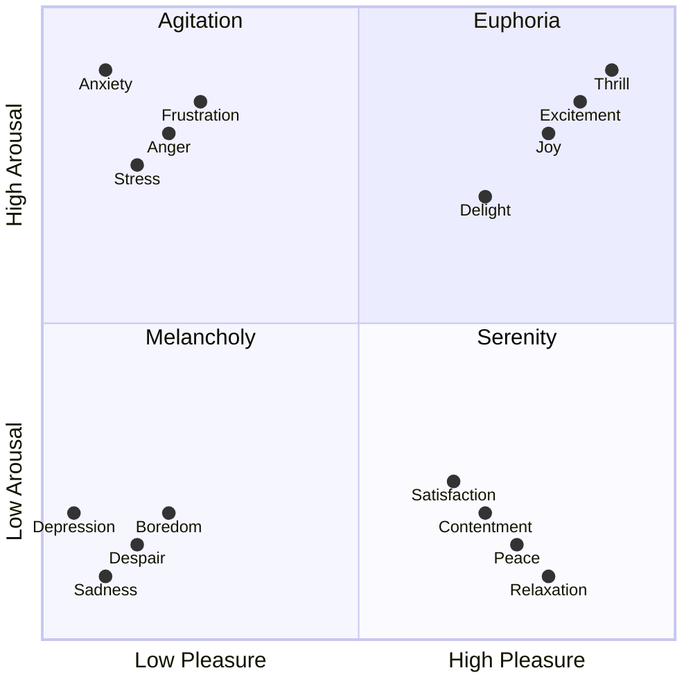

"I didn't have time" is usually a lie, the limiting factor isn't time, it's energy. That's good because time is finite, and monotonically decreasing. Energy, by contrast, is dynamic. Activities and experiences can create and destroy energy. What's amazing to me is how going to the gym can be energy positive.

## Theory

### Energy is very non-linear

You can get a blast of energy when someone smiles at you. [Joy](/joy) is like that. Doing nothing, like watching TikTok can be very draining. I even have a set of Kryptonite activities which drain me



### Energy (Arousal) vs Valence

[Mood](/mood) can also look like arousal and valence

### Do we want to always be high energy?

1. It's not appropriate for the situation - A funeral is not the time to be high energy.
1. It's not sustainable - we can take in caffiene, or stimulants, but then we have to pay it back.

Cocaine? Mania? Not good.



### Activation Energy



## Maximize Energy

### Very similar to maximize productivity



### Sleep



### Match task to energy

No point spending "my high energy/will power time" on a low energy activety. It's funny, my strongest energy is when I wake up, which seems like a waste to spend on the gym, except when I don't spend that on the gym it makes a mess.

### Remember to take some time off


