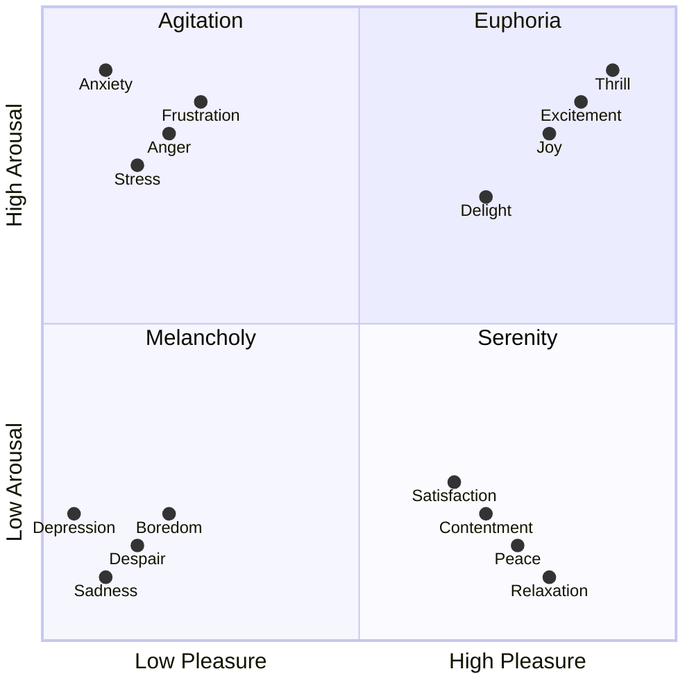

"I didn't have time" is usually a lie, the limiting factor isn't time, it's energy. That's good because time is finite, and monotonically decreasing. Energy, by contrast, is dynamic. Activities and experiences can create and destroy energy. What's amazing to me is how going to the gym can be energy positive.

### Energy (Arousal) vs Valence

[Mood](/mood) can also look like arousal and valence

### When ephoria gets stuck on high?

Cocaine? Mania? Not good.



### Activation Energy


