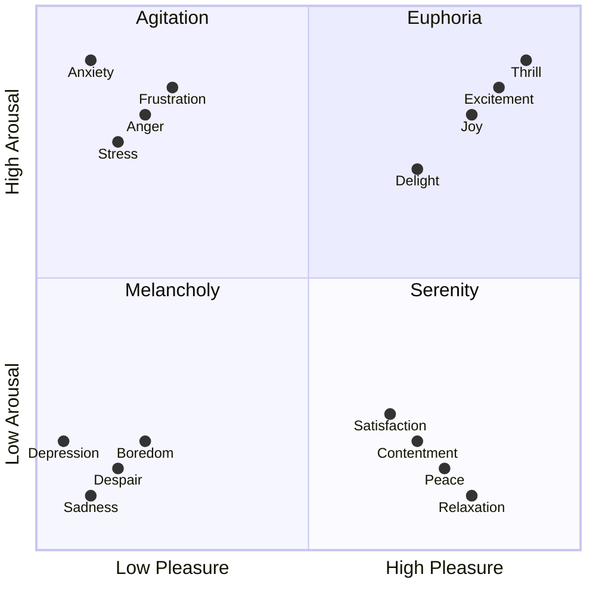

We often say we don't have time, but usually we mean we don't have energy. That's great news because time is finite, and monotonically decreasing. Energy, by contrast, is dynamic. Activities and experiences can create and destroy energy. What's amazing to me is how going to the gym can be energy positive.

## Theory

### Energy is very non-linear

You can get a blast of energy when someone smiles at you. [Joy](/joy) is like that. Doing nothing, like watching TikTok can be very draining. I even have a set of Kryptonite activities which drain me.



### Doing work can result in more energy

It's amazing to me that a good workout does this. So does a productive day at work.

### Energy drains, regardless of if it's being applied to do work

In fact, sometimes it even drains worse, so care deeply about



### Wasting energy can accelerate the drain

- Or maybe it makes your energy weaker



### Energy fuels will power

I need to reflect - what is the difference between these concepts in my model? Certainly, will power is a function of energy, Maybe u-shaped, too much or too little energy, no will power, middle it's pretty solid.

### Activation Energy can far exceeds steady state energy



There is an analogy here with physical devices, like cars have a starter motor which is only required for starting up after which you switch to the steady state motor

### We can go into energy debt, but you need to always pay the piper

Let's say I'd naturally have 4 hours of energy today. Let's say I drink a ton of coffee and add an extra 1 hours. That gives me 5 hours of energy! w00t! But then, since I'm jacked up on caffeine, I sleep poorly, and am slogging through tomorrow, and operating at 50% efficiency for most of the 4 hours the next day, basically losing 1 hour. So, now I'm actually down an hour over 2 days. Ugh. And worse, I'm in debt as that energy was probably allocated to something else.

### You can reduce the energy required

- See productivity
- By having habits
- By shaping the path
- By being stronger "peak energy" capacity (think strength training)
- By building more "energy endurance" capacity (think cardiovascular)
- Q: Is there an analog to hypertrophy? (Influencer Videos - haha)

### Energy (Arousal) vs Valence

[Mood](/mood) can also look like arousal and valence

### Do we want to always be high energy?

1. It's not appropriate for the situation - A funeral is not the time to be high energy.
1. It's not sustainable - we can take in caffeine or stimulants, but then we have to pay it back.

Cocaine? Mania? Not good.



## Maximize Energy

### Very similar to maximize productivity



### Sleep



### Match task to energy

You'd think there is no point spending "my high energy/will power time" on a low computational activity like going to the gym. So you'd think I'd go to the gym after work.

Except. Going to the gym charges me up, and it takes significant will power. So I take my high energy in the morning when my will power is high and spend it on going to the gym.

### Remember to take some time off


