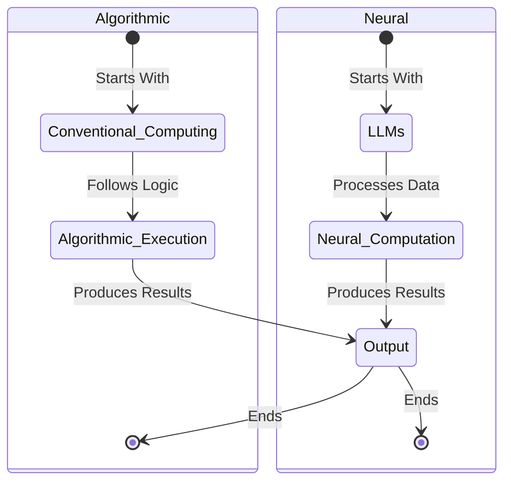
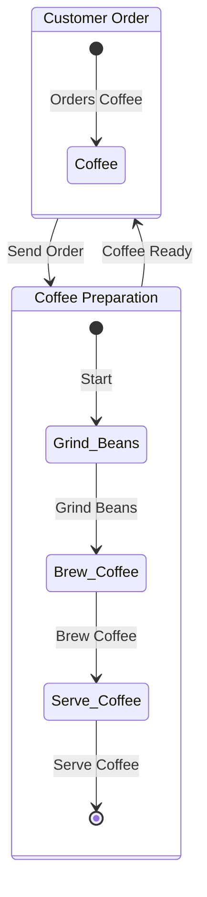
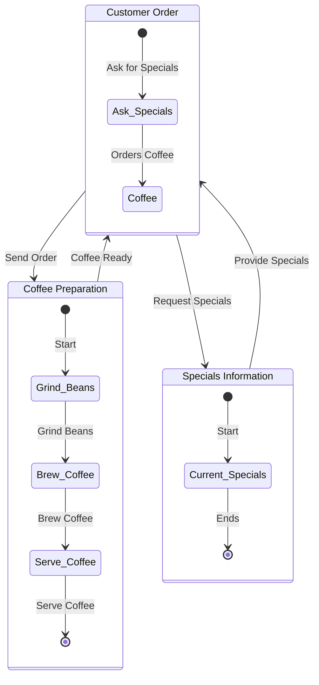

Generative AI (GenAI) is taking the world by storm, and it takes a new mindset to make use of it as a programmer. A good mental model of GenAI is interns!

<!-- prettier-ignore-start -->
<!-- vim-markdown-toc-start -->

- [A New Computational Model - Interns](#a-new-computational-model---interns)
    - [The Perfect Intern](#the-perfect-intern)
    - [Bad Intern - Quirks and Mitigations](#bad-intern---quirks-and-mitigations)
    - [Your Intern Can't Read Your Mind - Prompting](#your-intern-cant-read-your-mind---prompting)
    - [Why the heck did your intern do that - Understandability](#why-the-heck-did-your-intern-do-that---understandability)
    - [Brain Surgery - Do I need to understand parameter count and neural networks](#brain-surgery---do-i-need-to-understand-parameter-count-and-neural-networks)
- [Use cases: What should we hire the intern to do?](#use-cases-what-should-we-hire-the-intern-to-do)
    - [The Perfect Sandals - Remember the user problem](#the-perfect-sandals---remember-the-user-problem)
    - [Relationships](#relationships)
    - [Summarize](#summarize)
    - [Express myself](#express-myself)
    - [Programmer](#programmer)
- [Programs with hidden interns - Blending Code and Mind Reading](#programs-with-hidden-interns---blending-code-and-mind-reading)
    - [LLM as Computer](#llm-as-computer)
    - [Natural Language and reasoning as state](#natural-language-and-reasoning-as-state)
    - [How to merge a program and user input with prompts](#how-to-merge-a-program-and-user-input-with-prompts)
    - [How to maintain state with prompts](#how-to-maintain-state-with-prompts)
    - [How to influence control flow with prompts](#how-to-influence-control-flow-with-prompts)
    - [How to interact with external systems with prompts](#how-to-interact-with-external-systems-with-prompts)
    - [Great, why not just write the whole program in prompts](#great-why-not-just-write-the-whole-program-in-prompts)
    - [The Before Times - It's All Code (Code)](#the-before-times---its-all-code-code)
    - [The Perfect Program - It Just Reads Your Mind (Prompts)](#the-perfect-program---it-just-reads-your-mind-prompts)
    - [Maybe Reading Your Mind Is Too Hard - Input Affordances](#maybe-reading-your-mind-is-too-hard---input-affordances)
        - [Natural Language Input](#natural-language-input)
        - [Constrained Language Input](#constrained-language-input)
        - [Graphical Selection](#graphical-selection)
    - [Give Me Choices - Output Affordances](#give-me-choices---output-affordances)
        - [Select between multiple outputs](#select-between-multiple-outputs)
        - [Use output to help refine my input](#use-output-to-help-refine-my-input)
        - [Use output to help refine my tuning of input](#use-output-to-help-refine-my-tuning-of-input)
    - [Code and Prompt, finding the right balance](#code-and-prompt-finding-the-right-balance)
- [Re-thinking prompts](#re-thinking-prompts)
- [The Final Review: How did my intern do?](#the-final-review-how-did-my-intern-do)
    - [Engagement Based](#engagement-based)
    - [Expert based](#expert-based)
        - [Using a model to evaluate a model.](#using-a-model-to-evaluate-a-model)
    - [Oops workflows - Insurance](#oops-workflows---insurance)
- [Ethics](#ethics)
    - [Societal Bias](#societal-bias)
    - [Copyright infringement](#copyright-infringement)
- [Bad Intern - All the things that can go wrong](#bad-intern---all-the-things-that-can-go-wrong)
    - [Alignment - Don't be evil](#alignment---dont-be-evil)
    - [Git supply chain attacks](#git-supply-chain-attacks)
    - [AGI taking over the world](#agi-taking-over-the-world)
- [Appendix](#appendix)
    - [LLM-Book](#llm-book)
    - [Talk to the intern](#talk-to-the-intern)
    - [Disclaimer](#disclaimer)
    - [What is a prompt engineer?](#what-is-a-prompt-engineer)

<!-- vim-markdown-toc-end -->
<!-- prettier-ignore-end -->

## A New Computational Model - Interns

ASIDE: No interns were harmed in the creation of this talk. I love interns, and have been one myself. I'm just using them as a metaphor for LLMs. If you're an intern, or recently graduated, feel free to read my advice to y'all - <http://bit.ly/igor-advice-22>

### The Perfect Intern

- Super smart
- Super creative
- Understand English and high complexity
  - Don't need to 'dumb it down', just talk in natural language
- Infinite creativity
  - Don't need to 'search' for an image, just have them generate it!

### Bad Intern - Quirks and Mitigations

- But makes mistakes
- So you need to coach and guide
- Non-deterministic: Every call you get a different intern.
- Sometimes it'll just be a bad intern, can lie, or ignore instructions.
- Slow: Current models have bad latency and rate limits (bleh)
- TODO: Link to build '23 talk by OpenAI scientist.
- Sometimes you get a dud and they ignore the instructions. :(
- The longer the answer, the more they can think; short answers have them thinking less.
- Once committed to an answer, even if wrong, they'll keep going.
- Very dangerous, since so used to smart, honest interns, when you get a bad intern that's confident, it can really throw you for a loop.

### Your Intern Can't Read Your Mind - Prompting

- Input is conversational.
- When instructing our intern, we assume we have sufficiently specified what we want.
- But very quickly realize you haven't.
- Very hard to evaluate if your intern did good
- See prompt engineering.

### Why the heck did your intern do that - Understandability

### Brain Surgery - Do I need to understand parameter count and neural networks

- No more than you need to understand dopamine or synapses.

## Use cases: What should we hire the intern to do?

### The Perfect Sandals - Remember the user problem

- What makes perfect sandals?
- Research, you build, but no one buys?
- What is going on? You go out and do user studies. Turns out the users are trying to mountain climb, no sandal will work for them.
- Start by understanding the problem you are trying to solve, see how you can use AI to help solve that problem.
- Otherwise the anti-pattern, a solution looking for a problem

### Relationships

- AI Partner - Replika
- Therapist - 7 Cups of Tea
- Celebrity - Caryn.ai

### Summarize

### Express myself

- Grammarly

### Programmer

- Copilot
- Code Review
- Security Scanning

## Programs with hidden interns - Blending Code and Mind Reading

Conventional Programming vs Delegating to an Intern

### LLM as Computer

- (Thinking: Should there be a concept of conversation sidebared)
- LLM is a really simple computer/CPU
  - A prompt for input, a response for output.
  - Stateless
  - No control flow
  - No I/O (Except the prompt, and the response)
  - No Reading External Storage
- In classical coding, the computer program is separate from the user input,
  - In LLM there's only the prompt.
  - Thus the prompt must be the program and the input
  - So think of the prompt as the resolution of PromptTemplate(UserInput)
- In classical coding, there are variables, and control flow,
  - In LLMs there are only the prompt
  - We can simulate state/control flow by keeping the history of the previous prompts/response in the current prompt
  - This is why the prompt format of messages has evolved.
- In classical coding you can access storage, and have lots of RAM.
  - In LLMs you can access no storage beyond the prompt (think of it as RAM)
  - In LLMs you have limited RAM, so you need to be efficient with it.
  - In LLMs use need to efficiently use the RAM, by deciding which data to place in it.

### Natural Language and reasoning as state

Talk about how weird it is coming with a computer mindset

### How to merge a program and user input with prompts

Create a prompt by instantiating a prompt template with the user input.

PromptTemplate = "I'll ask these facts later {user_input}"

Prompt:

```ascii
Here is a conversation between an AI and a user,  The AI is very curt.
 USER: I'll ask these facts later. I like fruit
```

Response:

```ascii
AI: Noted.
```

### How to maintain state with prompts

When talking to an intern, they have state in that they remember the conversation. But as we discussed you get a new intern for every call to the intern factory.

You work around this "stateless" problem by having the prompt be the entire conversation to date.

Say we now want to ask what fruit the user likes, the prompt is not just

Prompt:

```ascii
USER:  What food do I like?
```

It has to include the entire history

```ascii
Here is a conversation between an AI and a user,  The AI is very curt.
USER: I'll ask these facts later. I like fruit
AI: Noted.
USER:  What food do I like?
```

Response:

```ascii
AI: You like fruit.
```

Here's where the term prompt gets confusing. Prompt refers to the entire prompt passed to the LLM, which is the entire conversation. However, like most conversations, it is usually append only with the latest user's input transformation on the end (more complexity, but will save that for later).

So normally it's:

```python
prompt = PromptTemplate(get_user_input())
conversation += [prompt]
conversation += CallLM(conversation)
```

E.g. extend the conversation by extending only a single new prompt

And the only output to the user is the final response

### How to influence control flow with prompts

Should I merge with the next one?

### How to interact with external systems with prompts

- (Thinking) there is program execution as represented by history, but there's also program execution as requested by the LLM. Need to think through that.

Physically, prompts can only do stateless data transformations, not control flow or I/O.

### Great, why not just write the whole program in prompts

### The Before Times - It's All Code (Code)

### The Perfect Program - It Just Reads Your Mind (Prompts)

- At design time you make a few static prompts, and use that to design a template
- At compile time you include a template in your program
- At runtime you create a prompt by instantiating a template with the user (or program) input

### Maybe Reading Your Mind Is Too Hard - Input Affordances

#### Natural Language Input

#### Constrained Language Input

#### Graphical Selection

### Give Me Choices - Output Affordances

#### Select between multiple outputs

#### Use output to help refine my input

#### Use output to help refine my tuning of input

### Code and Prompt, finding the right balance

Hold



Coffee Shop Front Desk



What if we extend that to include specials



**Algorithmic Computing:**

_Pros:_

1. Deterministic: Algorithmic computing is deterministic, which means given the same input, it will always produce the same output.
2. Efficiency: Algorithms can be extremely efficient for complex tasks if they are well-designed.
3. Understandability: These systems can be easier to debug and troubleshoot due to their deterministic nature.
4. Scalability: Algorithmic programs can be easily scaled up and down.

_Cons:_

1. Rigidity: Algorithms follow a strict set of rules, which can make them less adaptable to new or unexpected scenarios.
2. Complexity: Creating efficient and effective algorithms can be complex and time-consuming.
3. Data Limitations: Algorithmic computing may not perform well with incomplete or fuzzy data.

**Neural Computing (LLMs or Large Language Models):**

_Pros:_

1. Adaptability: Neural networks, or LLMs, are capable of learning and adapting to new scenarios and data.
2. Handling Unstructured Data: They can handle unstructured or incomplete data well.
3. Pattern Recognition: LLMs excel at identifying patterns and correlations in large data sets.
4. Non-Linearity: They can model complex, non-linear relationships.

_Cons:_

1. Interpretability: Neural networks can be seen as black boxes, making it difficult to understand how they reach their conclusions.
2. Training Requirements: They require large amounts of data and computational resources for training.
3. Overfitting: Without proper regularization, LLMs may overfit to the training data and perform poorly on unseen data.

| Traits                                 | Algorithmic Computing                                            | Neural Computing (LLMs)                                                                        |
| -------------------------------------- | ---------------------------------------------------------------- | ---------------------------------------------------------------------------------------------- |
| **Deterministic/Adaptability**         | Deterministic: Same input always results in the same output      | Adaptability: Capable of learning and adapting to new data and scenarios                       |
| **Efficiency**                         | Efficient for complex tasks if well-designed                     | Needs large amounts of data and computational resources for training                           |
| **Understandability/Interpretability** | Understandable: Easier to debug due to deterministic nature      | Less Interpretable: Seen as 'black boxes', making it difficult to understand their conclusions |
| **Handling Data**                      | Less effective with incomplete or fuzzy data                     | Can handle unstructured or incomplete data well                                                |
| **Pattern Recognition**                | Limited to the rules and patterns explicitly programmed          | Excel at identifying patterns in large data sets                                               |
| **Non-Linearity**                      | Struggles with complex, non-linear relationships                 | Excels at modeling complex, non-linear relationships                                           |
| **Rigidity/Flexibility**               | Rigidity: Follows a strict set of rules                          | Flexibility: Can learn and adjust based on new data                                            |
| **Complexity**                         | Can be complex and time-consuming to design efficient algorithms | Can become complex due to the need for data pre-processing, architecture selection, etc.       |
| **Scalability**                        | Easily scalable                                                  | Scalability can be a challenge due to computational demands                                    |
| **Risk of Overfitting**                | Less risk if properly designed                                   | High risk: May overfit to the training data without proper regularization                      |

## Re-thinking prompts

- Prompt+LLM is not the equivalent of an app running on an iPhone
- Prompt+LLM is the equivalent of assembly language running on an CPU that can only perform operations and output

The Prompt:

- Is not the program!
- It’s the assembly language for the LLM!

The LLM:

- Is not a CPU, that can take input, or request output
- It

So what should we call the program?

- Is the outer system which uses prompts as part of execution

The memory:

- Is not accessed by the CPU
- It is inlined into the prompt

The I/O:

- Is not accessed by the program directly
- Shim

You need to write: \* The compiler

## The Final Review: How did my intern do?

When you have non-deterministic systems, with unclear outputs, evaluating them is hard.



If you think about it, this is the same as evaluating a teacher or salesperson. There are 2 ways to do it:

### Engagement Based

1/ Look at the engagement. How did the end users engage with the product? Classic A/B testing with tiered deployment.

### Expert based

2/ Use an expert to evaluate. So, if you had

#### Using a model to evaluate a model.

Sure, this is exactly what we do with interns, we have a senior engineer evaluate them. Often we'll use a "cheaper model", and we can use an expensive model to assess the cheaper model.

The most expensive model is a human. If you don't trust your expensive models, then you can have them vote.

### Oops workflows - Insurance

Humans make mistakes too, and that's why we have insurance in the real world. The question is can you reduce the average cost.... E.g.

Old humans: Cost of transactions is high.
LLMs: Cost of transactions is much lower.

Old humans: Transactions*(Profit per Transaction) + Cost of Insurance.
LLMs: Transactions*(Profit per Transaction) + Cost of Insurance.

For example, if we can do 100x transactions at 1/1000th the cost, and insurance is 10x.

## Ethics

### Societal Bias

- Draw a picture of a doctor - 90% male.
- Societal biases are in the data, and the model will learn them.
- Yesterday's heretic might be today's genius.

### Copyright infringement

- If LLM spits out a book how much is copied from the author?
- Adobe's LLM has full licenses of content users
- Word for this is pedigree
- What if we make a fake actor, but with likeness of a real person

## Bad Intern - All the things that can go wrong

### Alignment - Don't be evil

- Getting around the blocks. Answer in Spanish, then translate the block to English.
- See password guessing - https://gandalf.lakera.ai/
- Red testing toolkit - https://github.com/declare-lab/red-instruct/

### Git supply chain attacks

### AGI taking over the world

## Appendix

### LLM-Book

Very deeply inspired by: <https://vladris.com/llm-book/>

### Talk to the intern

- Ha, make a chatbot from this post ... pending

### Disclaimer

These are my personal opinions and are not related to the opinions of my employer or any other organization I am affiliated with.

### What is a prompt engineer?

An interesting take - "a prompt engineer" is a word that can go the way of things like "information super highway", but if you think about what it is doing is saying instructions in a way that can be understood by another. This requires understanding requirements, and articulating them to match the person to whom you are giving them. Honestly,s ounds like a Product Manager
