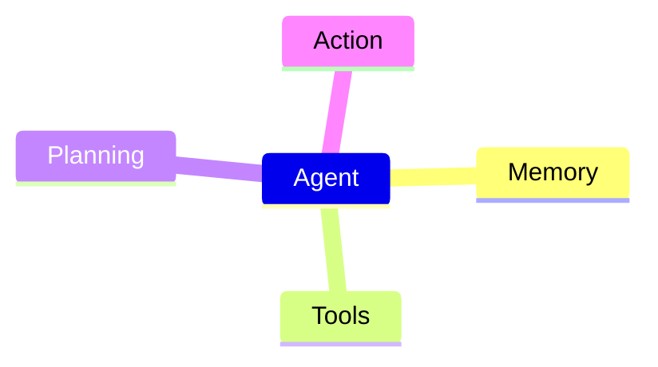
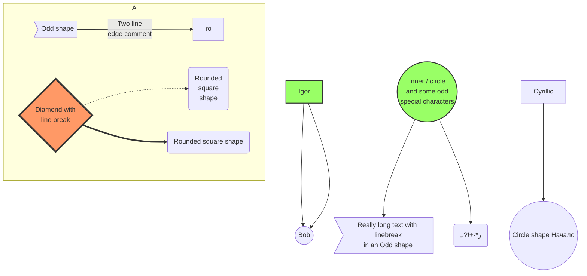
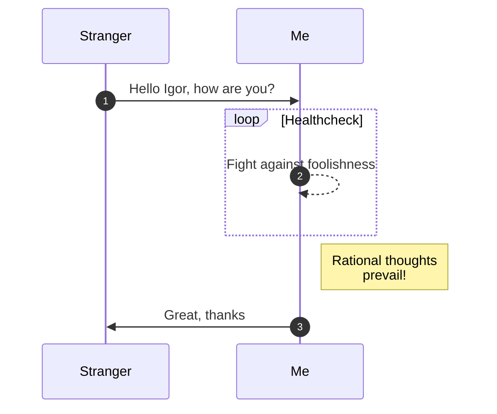
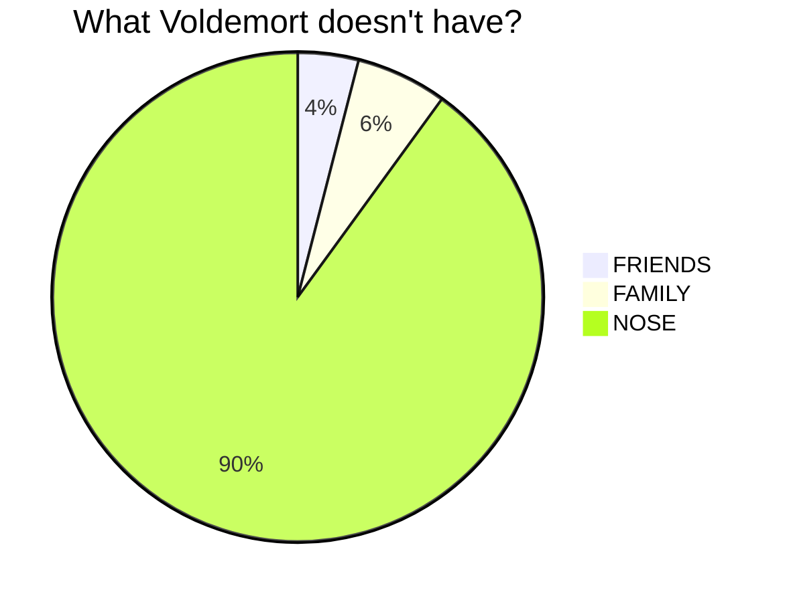

Lets try d2

Playing with Mermaid my friend.

Letting GPT-4 make the subgraphs

```mermaid
mindmap
Agent
    Memory
    Tools
    Planning
    Action

```

Trying with a flowchart for better up and down control

```mermaid
graph TB
    sq[Square shape] --> ci((Circle shape))
    sq[Igor] --> ci((Bob))

    subgraph A
        od>Odd shape]-- Two line<br/>edge comment --> ro
        di{Diamond with <br/> line break} -.-> or(Rounded<br>square<br>shape)
        di==>ro2(Rounded square shape)
    end

    %% Notice that no text in shape are added here instead that is appended further down

    e --> od3>Really long text with linebreak<br>in an Odd shape]

    %% Comments after double percent signs
    e((Inner / circle<br>and some odd <br>special characters)) --> f(,.?!+-*ز)

    cyr[Cyrillic]-->cyr2((Circle shape Начало));

    classDef green fill:#9f6,stroke:#333,stroke-width:2px;
    classDef orange fill:#f96,stroke:#333,stroke-width:4px;
    class sq,e green
    class di orange
```

```mermaid
sequenceDiagram
    autonumber
    participant S as Stranger
    participant M as Me
    S->>M: Hello Igor, how are you?
    loop Healthcheck
        M-->>M: Fight against foolishness
    end
    Note right of M: Rational thoughts <br/>prevail!
    M->> S: Great, thanks
```

Pie Chart

```mermaid
pie title What Voldemort doesn't have?
    "FRIENDS" : 2
    "FAMILY" : 3
    "NOSE" : 45
```

