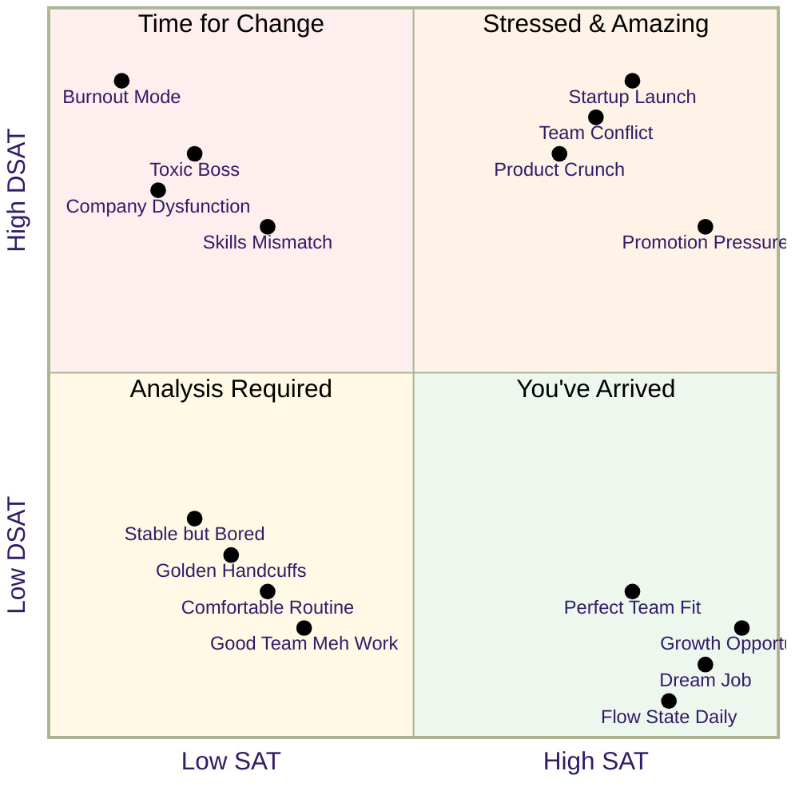

Love your work, and you'll never work a day in your life. Sounds great, but work ain't no Caribbean cruise - one you pay for, and the other pays you. Work should be satisfying (SAT). You should be enjoying solving hard problems, getting opportunities to talk with like-minded people, and even being forced to stretch and grow. Work should also cause you dissatisfaction (DSAT). Some days your boss will piss you off, your co-workers will misunderstand you, and you will be forced to do something you don't want to. Satisfaction is not a lack of dissatisfaction; they are orthogonal experiences. DSAT is what makes you sleep poorly, and SAT is what makes you set your alarm early Monday morning so you can get back to your favorite project, and to hang out with your awesome team. <!-- Need to make this wittier --> By understanding our SAT and DSAT, we can change them, and transform hours slogging into time at the fantasy cruise bar.

Not all SAT and DSAT are created equal nor do they need to be correlated. You know you've got DSAT when you're dreading going into work on Monday all weekend, feeling relieved your workday is over at 5pm, and being in a generally bad mood when talking to friends and family, or being unable to sleep at night. You know you have SAT when you wake up excited to work on a hard or interesting problem, a positive energy comes naturally when speaking with your team and cross-functional partners (for the most part), and not feeling like you need to zone out with 4 hours of TikTok to block out work.



<!--- Good, need to find something about the motivation ferry to sprinkle in.
### The motivation ferry

There’s no motivation fairy who will sprinkle magic dust on you. Motivation is the state of mind that comes from having a high SAT. If you’re motivated, it’s because you’re motivated.

-->

<!--

This is a very powerful paragraph. If it was focused on understanding SAT and DSAT, vs work and life, it would pull up higher, which I like.

But then the essay feels more about knowing yourself, vs improving your SAT and DSAT, which is probably a better essay, but maybe it can be a transition into this essay?

For these two orthogonal yet related vectors, the most important thing is to know what makes you tick. Can you pull out a piece of paper and write down what you want out of your work vs. what you want out of life? Is it clear enough you can hand it to your bestie and they can see what "isn't quite right"? If you can't, good news, you're human. This is a journey and knowing yourself is much harder than getting promoted to a senior engineer.

-->

<!--- Not sure where to stick this

Embrace the greatest parts of your work, mull over them, whether it's the bike ride in the park, the water cooler chat with a fellow techie, and stop dwelling on the fact that you may not have given your best for an architecture design review, there will always be another one; and if there's anything in life you can learn to get better in, it's work.

-->

<!-- prettier-ignore-start -->

<!-- vim-markdown-toc-start -->

- [General](#general)
  - [What's keeping you awake?](#whats-keeping-you-awake)
  - [What about the time you're not working?](#what-about-the-time-your-not-working)
- [The situation's a 2x2 matrix](#the-situations-a-2x2-matrix)
  - [High SAT Low DSAT](#high-sat-low-dsat)
  - [High DSAT, Low SAT](#high-dsat-low-sat)
  - [High SAT High DSAT](#high-sat-high-dsat)
  - [Low DSAT, Low SAT](#low-dsat-low-sat)
- [Influencing change](#influencing-change)
  - [Making the perfect job: Raising SAT](#making-the-perfect-job-raising-sat)
  - [Sleeping well at night: Lowering DSAT](#sleeping-well-at-night-lowering-dsat)
  - [Re-rolling: Changing teams or companies](#re-rolling-changing-teams-or-companies)
- [Satisfaction - AMP](#satisfaction---amp)
  - [Autonomy](#autonomy)
  - [Mastery](#mastery)
  - [Purpose](#purpose)
- [DSAT Deep Dive](#dsat-deep-dive)
  - [Conflict](#conflict)
  - [Insufficient Resources](#insufficient-resources)
  - [Insecurity](#insecurity)
  - [WLB](#wlb)

<!-- vim-markdown-toc-end -->

<!-- prettier-ignore-end -->

## General

<!--
I think there's a joke to be had here about something in your bed or your partner's grumbling
-->

### What's keeping you awake?

At the extremes, DSAT ruins your sleep. Be it unable to fall asleep, waking up in a panic angry at your co-worker, stressed you'll fail, or dreading work the next morning. SAT is being so excited about your project, you get up early Sunday morning to sneak in a few extra hours because you love your project.

### What about the time you're not working?

<!---

As written, it's all about SAT, not SAT and DSAT

-->

"I wish I spent more time at work" is never uttered on a [deathbed](/wlb). You have many [roles other than work](/eulogy), and balancing between them is the name of the game. While high work SAT is great for your career, it makes stopping work hard.

At the same time, where you work, what you work on, and how challenging it is, when going well, like a giant snowball gathering speed down a hill, is infectious. That SAT will bring energy and resilience to the other roles in your life.

While it's easy to stop working when you have low work SAT, that low SAT can be parasitic. It can lower your overall willpower and suck energy from the other roles in your life.



<!---
I kind of like this paragraph, but not sure how much it adds.
-->

We all want to make the most of our lives. While not every breathing moment should be about work, what's the point if what you do the majority of the time is mind-numbing or makes you grind a millimeter a month off your teeth.

## Work Satisfaction Matrix

### High SAT and Low DSAT - You've Arrived

You are in the ideal situation - you've arrived. But this will likely pass.

You need to learn what's working so you can replicate it later.

### Low SAT and Low DSAT - Analysis Required

You are in the hardest case - you've got a great gig, but something is missing.

You need to analyze what's lacking and make targeted improvements.

### Low SAT and High DSAT - Time for Change

You are in a situation requiring urgent change.

You need to read [Decisive](/decide), [The Dip](/the-dip), and if required, re-roll.

### High SAT and High DSAT - Stressed & Amazing

You are oscillating between stressed as hell and amazing. This situation tends to be unsustainable.

You need to understand if the DSAT is structural or temporal, e.g., just launched then everything calms down, or you're working with crappy people. If it's structural, there's an excellent chance the DSAT will grow into resentment, and you'll need to re-roll.

## Influencing change

There are two changes you'd like to make: increase your SAT, and decrease your DSAT.

### Making the perfect job: Raising SAT

First, to make nothing worse, you need to:

**Ring-fence your low SAT. Don't let it:**

- Affect your performance. When your performance tanks, DSAT will spike.
- Infect others. Emotions are contagious, and if others catch your low SAT, you'll have problems soon.
- Ignore the things and people that are keeping your DSAT low. Without nurturing and reinforcement, they may stop.
- Drain your energy. See the low SAT as an opportunity to invest in some of your other roles.

**Mine for gold: Increase your SAT:**

Odds are you're struggling with a lack of [AMP](/manager-book#l-motivation) (see next section),

You've got three paths:

Add stuff that brings you SAT. Pick up extra projects that bring you AMP.

Cut stuff that doesn't bring you SAT.

Examine the things that don't bring you SAT, and see what you can adjust to squeeze out more SAT. For example:

### Sleeping well at night: Lowering DSAT

DSAT is often caused by people or structural problems. These are hard to influence.

Even when there are small improvements, you may have residual [mental pain](/mental-pain), which leaves you reactive, slowing your ability to lower DSAT.

Sometimes the right thing to do here is a re-roll.

### Re-rolling: Changing teams or companies

When you have a structural problem and you can't influence the changes you need (see [The Dip](/the-dip)), the right thing to do may be finding a new team or company.

While easy to think, it's very easy to misassess the situation. The grass is always greener on the other side of the fence, and sometimes the issue you think is your environment may be you. Before you go down this path, skim [Decisive](/decisive) and listen to [Switching Jobs or Staying Where You Are](https://heathbrothers.com/member-content/decisive-for-job-decisions/decisive-for-job-decisions-2/). It takes 30 minutes, but given how hard job changes are, I strongly recommend it.

If you're still committed, check out:

- [Reducing Job Hunt Stress](/job-hunt-stress)
- [Only Care About Total Compensation](/comp)

## Satisfaction - AMP

For a deeper dive into the psychology of motivation, see [Drive by Daniel Pink](/manager-book#l-motivation).

**TODO**: This section is in progress.

## DSAT Deep Dive

Still fleshing out, but here are some relevant breadcrumbs ...

### Conflict





### Insufficient Resources



### Insecurity




### WLB




