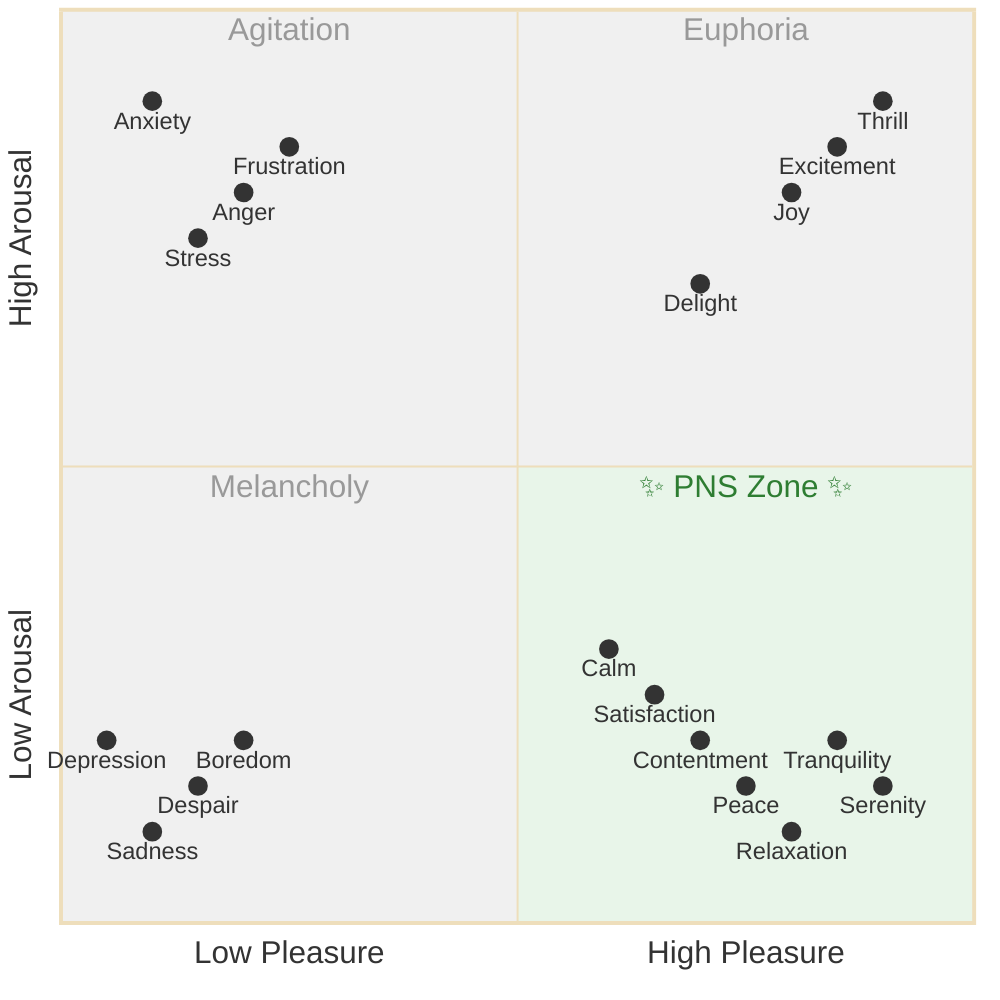

Fight or flight, the sympathetic nervous system, gets all the attention, but its twin sister "Rest and Digest" or the parasympathetic nervous system is equally important. These are the two divisions of the Autonomic Nervous system — the stuff that operates without conscious control. While everyone's obsessed with productivity and hustle, your body's crying out for balance. Here's the thing: you can't sprint a marathon, and life's definitely a marathon.





<!-- prettier-ignore-start -->
<!-- vim-markdown-toc-start -->

- [Why Going Slow Matters](#why-going-slow-matters)
- [When High Energy Isn't the Answer](#when-high-energy-isnt-the-answer)
  - [Situations Where Less is More](#situations-where-less-is-more)
  - [The High-Energy Trap](#the-high-energy-trap)
- [Understanding Energy States](#understanding-energy-states)
  - [Two Reasons to lower your arousal](#two-reasons-to-lower-your-arousal)
- [THoughts to digest](#thoughts-to-digest)
  - [Low arousal is not laziness](#low-arousal-is-not-laziness)
  - [The resistance blocks low arousal too](#the-resistance-blocks-low-arousal-too)
  - [Is social media/mindless consumption addiction lowering arousal?](#is-social-mediamindless-consumption-addiction-lowering-arousal)
  - [Does Rest and Digest system result in better decisions than fight or flight](#does-rest-and-digest-system-result-in-better-decisions-than-fight-or-flight)
- [How to Strengthen Your Parasympathetic Nervous System](#how-to-strengthen-your-parasympathetic-nervous-system)
  - [Breathing Techniques](#breathing-techniques)
  - [Physical Practices](#physical-practices)
  - [Mental and Lifestyle Practices](#mental-and-lifestyle-practices)
- [The Science Behind the Names](#the-science-behind-the-names)
- [HRV and vagal nerve](#hrv-and-vagal-nerve)
- [The Bottom Line](#the-bottom-line)
- [Related Topics](#related-topics)

<!-- vim-markdown-toc-end -->
<!-- prettier-ignore-end -->

## Why Going Slow Matters

When your PNS is weak, you're stuck in chronic stress mode. Your body never gets the memo that the tiger isn't chasing you anymore. You're burning out your adrenals, wondering why you're tired but wired at 2 AM and not interested in anyone but yourself.



## When High Energy Isn't the Answer

We're conditioned to believe more energy is always better. Wake up earlier! Work harder! Push through! But here's what nobody talks about: sometimes high energy is exactly what you don't need.



### Situations Where Less is More

**Before Sleep**: That 9 PM burst of energy? That's not productivity calling — it's your circadian rhythm crying for help. High energy at night means poor sleep, which means tomorrow's crash.

**In Relationships**: High energy can manifest as impatience, interrupting, or overwhelming others. Sometimes the most powerful thing you can do is slow down and truly listen.

**In Reflection**: TODO: Add

**In Creative Work**: Breakthrough insights come during [rest](https://en.wikipedia.org/wiki/Default_mode_network), not grinding. Your default mode network — the brain's creative engine — only activates when you're not actively focusing.

### The High-Energy Trap

Chronic high energy isn't strength — it's dysregulation. It's like:

- A car stuck in third gear trying to navigate a parking lot
- A computer with 100 browser tabs open wondering why it's slow
- A phone on max brightness complaining about battery life

You're not meant to be "on" all the time. Even your heart — that tireless worker — spends more time resting between beats than beating.

## Understanding Energy States

Your energy state isn't just high or low — it's a combination of arousal (energy level) and valence (pleasure). Understanding where you are on this map helps you recognize when you need to shift states:

This "PNS Zone" — the **low arousal, high pleasure** quadrant — is where your parasympathetic nervous system thrives. These are the most sustainable positive states: contentment, relaxation, peace, tranquility.

### Two Reasons to Lower Your Arousal

**1. You're anxious or stressed (The obvious one)**
When you're stuck in agitation (high arousal, low pleasure), your body is screaming for relief. Anxiety, stress, frustration — these states are meant to be temporary alarms, not permanent addresses. The PNS Zone is your escape route from the stress cycle. Everyone knows being stressed sucks.

**2. You want to appreciate and be present (Less obvious, but equally important)**
Here's what people miss: You can't smell the roses when you're sprinting past them. Gratitude, presence, appreciation — these only bloom in the PNS Zone. When your nervous system is calm, you can actually experience life rather than just surviving it. This is where meaning lives. You could have the perfect life on paper, but if you're always activated, you'll never actually feel it.

## Thoughts to digest

### Low arousal is not laziness

In fact, it might be arousal

### The resistance blocks low arousal too

Or at least, it blocks the activities that get you there



### Is social media/mindless consumption addiction lowering arousal?

I'm not sure, but I suspect it may be

### Does Rest and Digest system result in better decisions than fight or flight

- Notice we say I need time to digest that?
- Often we hear something it wacks us hard, and we need to "digest it", often once we've calmed down.
- Is planning mode more Rest+Digest while doing is Fight or Flight,

During lower arousal states, the prefrontal cortex (PFC) - crucial for executive functions like planning, decision-making, and reflection - operates more effectively. High arousal and stress trigger elevated cortisol and norepinephrine, which can impair PFC function and shift brain activity toward more primitive regions focused on immediate threats.

Studies demonstrate that moderate to low arousal enhances cognitive flexibility - the ability to switch between different concepts and perspectives, crucial for effective planning. The Yerkes-Dodson law indicates that while some arousal helps with simple tasks, complex cognitive tasks (like planning) suffer under high arousal.

Lower arousal states facilitate better integration of information from the hippocampus to the cortex, supporting the type of memory consolidation needed for drawing on past experiences during planning.

Higher vagal tone (indicating parasympathetic dominance) correlates with better emotional regulation, cognitive flexibility, and executive function. Heart rate variability studies show that people with higher vagal tone perform better on tasks requiring planning and reflection.

## How to Strengthen Your Parasympathetic Nervous System

### Breathing Techniques

**4-7-8 Breathing**: The physiological sigh that actually works

- Inhale through nose for 4 counts
- Hold for 7 counts
- Exhale through mouth for 8 counts
- Do 4 cycles, twice daily

Why it works: Extended exhales activate the vagus nerve, your PNS's main highway. The longer exhale than inhale is the key — it's literally telling your body "we're safe now."

**Box Breathing**: Navy SEALs use this for a reason

- Inhale for 4 counts
- Hold for 4 counts
- Exhale for 4 counts
- Hold empty for 4 counts

This creates predictability, and your nervous system loves predictability.

### Physical Practices

**Cold Exposure**: Start with cold showers

- End your shower with 30 seconds of cold water
- Build up to 2-3 minutes
- Focus on slow, controlled breathing during exposure

The shock activates sympathetic briefly, but the recovery is all parasympathetic. It's like strength training for your nervous system.

**Gentle Movement**: Not everything needs to be HIIT

- Yoga (especially yin or restorative)
- Tai Chi
- Walking in nature (bonus points for barefoot on grass)
- Swimming at a relaxed pace

These activities promote PNS activation without the stress response of intense exercise.

**Massage and Physical Touch**:

- Self-massage with tennis balls or foam rollers
- Professional massage therapy
- Hugging (20-second hugs release oxytocin)
- Pet therapy (petting animals lowers cortisol)

Why these work: Physical touch activates the vagus nerve, your PNS's main highway. It also triggers the release of oxytocin (the bonding hormone) and reduces cortisol (the stress hormone). Touch is a primal safety signal — it tells your nervous system "you're not alone, you're safe."

### Mental and Lifestyle Practices

**Meditation and Mindfulness**:

- Start with just 5 minutes daily
- Use apps like Headspace or Calm if you need structure
- Try body scans — they directly engage PNS awareness
- Practice gratitude meditation (it shifts you from threat-scanning to appreciation)
- Consider Search Inside Yourself techniques for emotional intelligence



## The Science Behind the Names

Why do they have these weird names?

- **Sympathetic Nervous System (SNS)**: The term "sympathetic" comes from the Greek word "sympathes," which means "having a fellow feeling" or "affected by the same disease." In the context of the nervous system, it refers to the idea that this system broadly activates various organs and tissues throughout the body to respond in a coordinated manner during stress.

- **Parasympathetic Nervous System (PNS)**: The prefix "para-" means "beside" or "alongside." This indicates that the parasympathetic system works alongside the sympathetic nervous system but often in opposition to it. While the sympathetic system prepares the body for action, the parasympathetic system helps calm it down and maintain homeostasis.

## HRV and vagal nerve

HRV seems to be the standard to measure

- Talk about HRV and GLP-1 inhibitors

## The Bottom Line

You can't be "on" all the time. Your parasympathetic nervous system isn't optional — it's essential. Every time you skip rest in favor of productivity, you're borrowing from tomorrow's performance. The irony? Strengthening your PNS actually makes you more productive when it matters. You'll think clearer, react better, and have more sustainable energy.

Start small. Pick one technique from above and do it for a week. Your nervous system didn't get dysregulated overnight, and it won't heal overnight either. But every breath, every cold shower, every moment of genuine rest is a deposit in your resilience bank account.

Remember: Going slow isn't lazy. It's strategic.

## Related Topics














