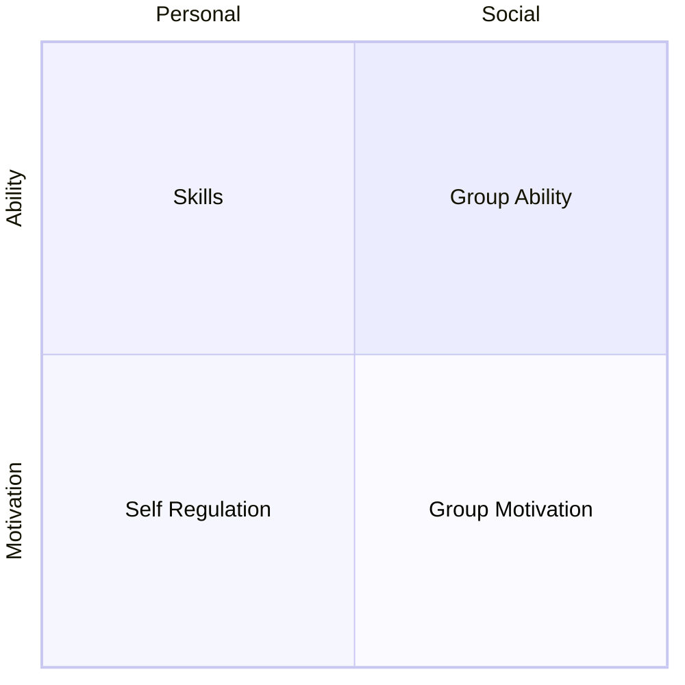

Human action can be modelled by an elephant, a rider and the path. Our emotional side the Elephant and our rational side the Rider. Perched atop the Elephant, the Rider holds the reins and seems to be the leader. But the Rider's control is precarious because the Rider is so small relative to the Elephant. Anytime the six-ton Elephant and the Rider disagree about which direction to go, the Rider is going to lose. He's completely overmatched. Lastly the path, is the structural elements that nudge your elephant and your rider in a direction, without effort.

| Attribute             | Chapters |
| --------------------- | -------- |
| Direct the Rider      | [l1](l1) |
| Motivate the Elephant | [l2](l2) |
| Shape the Path        | [l3](l3) |

- l1
- Find the bright spots
- Script the critical moves
- Point to the destination

* l2
* Find the feeling
* Shrink the change
* Grow your people

* l3
* Tweak the environment
* Build Habits
* Rally the herd
* Keet the switch going



<!-- prettier-ignore-start -->

<!-- vim-markdown-toc GFM -->

- [About Change](#about-change)
- [Direct the rider](#direct-the-rider)
    - [2. Find the Bright Spots](#2-find-the-bright-spots)
    - [3. Script the Critical Moves](#3-script-the-critical-moves)
    - [4. Point to the Destination](#4-point-to-the-destination)
- [Motivate the elephant](#motivate-the-elephant)
    - [5. Find the Feeling](#5-find-the-feeling)
    - [6. Shrink the Change](#6-shrink-the-change)
    - [7. Grow Your People](#7-grow-your-people)
- [Shape the path](#shape-the-path)
    - [8. Tweak the Environment](#8-tweak-the-environment)
    - [9. Build Habits](#9-build-habits)
    - [10. Rally the Herd](#10-rally-the-herd)
    - [11. Keep the Switch Going](#11-keep-the-switch-going)
    - [How does this apply to diet](#how-does-this-apply-to-diet)
- [Other models](#other-models)
    - [Behavior Change - Prompt, Ability, Motivation](#behavior-change---prompt-ability-motivation)
    - [Influencer 2.0](#influencer-20)

<!-- vim-markdown-toc -->
<!-- prettier-ignore-end -->

# About Change

# Direct the rider

## 2. Find the Bright Spots

## 3. Script the Critical Moves

## 4. Point to the Destination

# Motivate the elephant

## 5. Find the Feeling

## 6. Shrink the Change

## 7. Grow Your People

# Shape the path

## 8. Tweak the Environment

- Fundamental Attribution Error
- Often situation resulting in the behavior, not the person.
- People problem is often a situation problem
- See who shaped your behavior.
  - Want you to slow down, narrower roads
  - Want you to shop more, put milk (which you need at the back)
  - Don't leave ATM card in machine, so need to get card before taking out cash
  - Reach for carrots, not stick
- Ask to watch people who have trouble, you'll see them follow the easiest path.
- Medication Vests
  - Everyone hated it
  - 50% better ..
  - When saw impact, people start to like it.
- Hold the marker when too many people talking at once
- Sterile time.
- People don't need to change, behavior does.
- Environment Changes more effective by People.
- Use smaller plates. Auto-refilling soup, people never stop.
- Self manipulation tools.
- This applies to magic (??) Is structural misdirection part of this
- Force yourself to close your laptop in meetings
- Fun to have "rider" outsmart our "elephant".
- Screen Time.
- Turn off notifications
- How to make undesirable outcomes structurally impossible.
- Look at Amazon's [COEs](/coe)
- Machine that can cut off hands by accident. Sturcutral fix, only turn on machine by making 2 buttons you need to touch with large y shape, so hands can't be near it.
- Can't life parking break off without touching brake.
- Focus - Pre-Event; - Seat belts - Air Bags - Mid-Event ; - Post-Event - Get Ambulance There quickly - Training for physio therapy
  Note, nothing about people's motivations or discipline.

## 9. Build [Habits](/habits)

## 10. Rally the Herd

## 11. Keep the Switch Going

## How does this apply to diet

# Other models

## Behavior Change - Prompt, Ability, Motivation

See [Habits](/habits)

Behavior is prompt + ability + motivation.

Focus on ability and prompt, motivation is fickle. Use motivation waves to do the large 1 time investments.

## Influencer 2.0

A different model to switch, also covering change management. Esssentially you need to influence through the following dimensions


