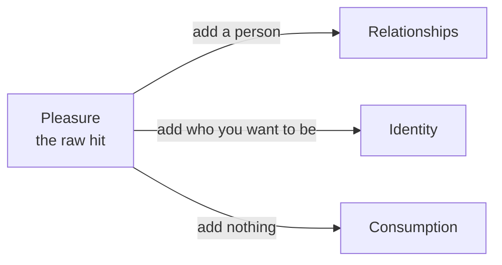

I asked myself a plain question this week: how is my time actually getting allocated? I expected the answer to be some version of work versus family. What I got was four buckets I invest in on purpose, and a fifth one I had never named, which quietly takes whatever the other four don't.



<!-- prettier-ignore-start -->
<!-- vim-markdown-toc-start -->

- [The five buckets](#the-five-buckets)
- [The bucket I never scored](#the-bucket-i-never-scored)
- [Consumption is pleasure that never got converted](#consumption-is-pleasure-that-never-got-converted)
- [The conversion: add a person, or add the person you want to be](#the-conversion-add-a-person-or-add-the-person-you-want-to-be)
- [Freed time rolls downhill](#freed-time-rolls-downhill)
- [Two of the good buckets have ceilings](#two-of-the-good-buckets-have-ceilings)
- [Compulsion lives in tech, addiction lives in consumption](#compulsion-lives-in-tech-addiction-lives-in-consumption)
- [So how is your time getting allocated?](#so-how-is-your-time-getting-allocated)
- [The open question: is tech a bucket, or an identity that overgrew?](#the-open-question-is-tech-a-bucket-or-an-identity-that-overgrew)

<!-- vim-markdown-toc-end -->
<!-- prettier-ignore-end -->

## The five buckets

Four are investments. The fifth is what's left.

**Tech.** Work, home projects, the AI tooling I build for myself, and deep thinking, which for me means writing this. Every one of those is a screen and me.

**Identity.** [Magic](/magic), biking, [ballooning](/balloon), the [joy](/joy) stuff. This is the bucket where I'm being someone rather than shipping something, which is [what a good hobby is for](/hobby). One word I want to be careful about: this is not "habits." Habits aren't a bucket. Habits are the machinery underneath one, the thing that gets me to the mat. Filing magic under habits would make "maker of smiles and wonder" a maintenance task.

**Health.** Physical, emotional, cognitive. I've [written up the dimensions elsewhere](/health); the thing that matters here is that they're one bucket, not three.

**Relationships.** Family and friends. This wants to be top-level, not a sub-item under identity. Arthur Brooks' four pillars of a happy life are faith, family, friendship, and work. Two of the four are other people.

**Consumption.** Everything else. The scroll, the autoplay, the forty minutes I can't account for.

The hours below are invented, not measured. Pull tech down and watch where the freed hours actually land.



## The bucket I never scored

I've written a weekly review for years. It's a big piece of the [mortality software](/mortality-software) I run on myself. It scores Work and Tech Guru, Family and Friends, physical and emotional habits, Identity Health and Magic. Every section is a good bucket. There is no section for consumption.

So my ledger has a hole in exactly the shape of the problem. I can have a week where nothing scores well and no line item tells me where the hours went, because they went into the one box I never drew.

The reviews do say one thing I didn't want to read. When a week gets tight, tech holds and family holds. They're protected. The place I borrow from is identity: the magic, the biking, the joy activities. The bucket that makes me me is the one I treat as discretionary.

## Consumption is pleasure that never got converted

Brooks has the distinction I was missing. Pleasure is the raw hit. It's solitary, it's chemical, and it's over the moment it's over. Enjoyment is what you get when you add two things to it:

> Enjoyment takes the source of pleasure and adds two things: people and memory.

That's from his Atlantic column, [Choose Enjoyment Over Pleasure](https://www.theatlantic.com/family/archive/2022/03/happiness-pleasure-enjoyment-consumption/629447/), and I unpacked the whole formula in my notes on [Build The Life You Want](/build-life-you-want). His gut check is the one I keep stealing: if you're doing it alone, you're probably doing it wrong.

So consumption isn't a category of activity. It's a stage. It's pleasure that stopped there.

Which means no activity is automatically in the leak. A beer alone on the couch and a beer at a table with friends are the same beer and different hours. The activity was never the variable, same as what I found staring at my [idle loop](/idle): what mattered was whether the thing handed anything back.

## The conversion: add a person, or add the person you want to be

If consumption is unconverted pleasure, the fix isn't abstinence. It's conversion, and there are two moves.

**Add a person, and the hour lands in Relationships.** The same video watched with my son, and talked about after, is not the same hour as the video watched alone in bed. Nothing about the content changed. The bucket changed.

**Add who you want to be, and it lands in Identity.** I can spend twenty minutes watching magic clips, or I can spend twenty minutes doing the trick badly until it stops being bad. Both start from the same pull. One of them makes me a magician.

Don't kill the pleasure. Upgrade it.

## Freed time rolls downhill

Here's the part that bothers me, and the reason I wrote any of this down.

I used to think the move was to shrink tech. Claw back five hours from the screen and surely they show up somewhere good. They don't. When I shrink tech, relationships and identity usually don't grow. Consumption does.

The reason is [activation energy](/activation). Consumption has negative starting energy: the phone starts itself, no decision required. Enjoyment needs a person, which needs a text and a calendar and somebody else's yes, and it needs a moment worth remembering, which needs a little bit of a plan. One of those two is free and it's the wrong one.

Which means freeing up time does nothing by itself. Freed hours don't get allocated, they get defaulted, and the default is level 0 of the idle loop: phone already in your hand, nothing got decided. If I want an hour to land in relationships, it needs a destination assigned before it exists. Otherwise I've just lowered the wall in front of the leak.

## Two of the good buckets have ceilings

Say I win that fight and assign the hour before it arrives. Two of the three buckets I'd assign it to can't take much.

Relationships is rate limited by the other people. I can decide to give my family ten more hours. They have to be free for those hours, and want them. That's the somebody else's yes from the last section. It's their ceiling, and I don't get a vote in it. Past it, the hours I add aren't relationship hours, they're me hovering.

Health saturates. There's a reasonable amount of sleep and movement, and the curve goes flat right after it. The second hour at the gym doesn't buy twice the health. Often it buys an injury.

That leaves identity. It's the one good bucket with real room, and it's the one with the highest activation energy. Nobody is waiting on me to do the trick badly for twenty minutes. The bucket with the most space is the hardest one to start.

## Compulsion lives in tech, addiction lives in consumption

I already had a framework for this and didn't notice it was the same one. In [Escape Artists](/addiction) I sort activities on two questions: am I compelled, and is the rest of my life worse for it. Compelled and worse is addiction. Compelled and not worse is passion. Not compelled is a hobby.

Line that up against the buckets and it's tidy in a way I don't love. Tech is where my compulsion lives, and it grades out as passion: pulled to it, life better on balance, opportunity cost attached. Consumption is where my addiction lives, with [TikTok](/addiction#tiktok-thought-escape) at the top of it, the thing I'm compelled to do and don't actually want.

So "shrink tech" is the wrong instruction on two counts. It cuts the passion, not the addiction, and it hands the recovered hours straight to the leak.

There's a second cost I underrate: the [monoculture trap](/addiction#dont-narrow-to-one-passion-the-monoculture-trap). The passion I overfeed isn't just taking hours from the other buckets, it's letting them wither. Identity doesn't sit patiently waiting for me to come back, it decays. And when the one passion I've been feeding has a bad month, the others aren't in shape to carry me.

## So how is your time getting allocated?

Two columns, because hours alone will lie to you. An hour of tech at 5am and an hour of tech at 9pm are not the same hour. My [willpower runs high in the morning and falls all day](/activation#will-power), so the prime hours are a different currency from the leftovers. It's easy to give relationships four hours a week and have every one of them be the exhausted kind.

Fill this in for a week. Actual hours, not intended ones.

| Bucket        | Hours this week | Of those, how many were prime-energy hours? |
| ------------- | --------------- | ------------------------------------------- |
| Tech          |                 |                                             |
| Identity      |                 |                                             |
| Health        |                 |                                             |
| Relationships |                 |                                             |
| Consumption   |                 |                                             |

Two things show up, and neither is the total you were bracing for. One bucket will be at or near zero, and a different one will have taken every good hour you had. That gap is the report.

The last row is the one no system has. If your week holds twenty hours you can't assign, that isn't a discipline problem, it's an unassigned-hours problem. The fix is to give those hours a person, or a person-you-want-to-be, before they arrive.

## The open question: is tech a bucket, or an identity that overgrew?

My weekly review has a section called Tech Guru. That's not a category of work. That's a role, the same kind of noun as magician, dad, husband, biker. Which makes me wonder if I've drawn this whole thing wrong.

Maybe it isn't four buckets and a leak. Maybe it's a set of identities, one of which got very good at feeding itself, plus a leak that mops up whatever that one doesn't take. [Roles are how I've always written the eulogy](/eulogy), and the eulogy is the document this is supposed to serve.

If that's right, the question stops being "how do I allocate my time" and becomes "which of my roles is eating the others." I don't know yet. But I notice that the version where tech is just a neutral bucket is the more comfortable version, and comfortable framings are usually the ones I should check first.




