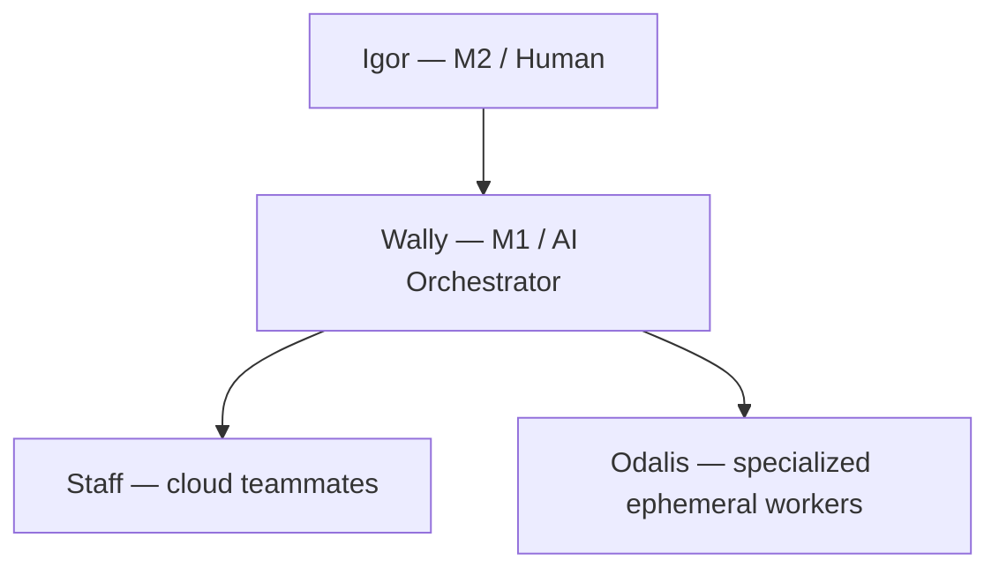

As I've explored being an [AI native manager](/ai-native-manager), one thing is emerging: I will certainly be an AI manager of bots. Let me tell you the story of [Wally](/igors-claws), and then I can go into it.

Wally is my M1 — the AI manager I built up from scratch. I named him so I could read about his work in status reports and remember which agent did what. I spent something like eight hours teaching Wally to write status reports I could actually read; another stint teaching him to write design docs I could review the way I'd review a good engineer's. The good news: once Wally got it, _Wally can train the others_. The pattern is the same one any [good manager](/manager-book) runs — patterns from previous reps, design docs shaped to the reviewer, lifestyle support that took longer than I expected. Eight hours of training a junior compounds when the junior can teach the next one.

That's the story. Now let me tell you what I've figured out about the org chart hiding inside it.



This is a survey post — the thinking is fresh, names are provisional, and there's at least one open question I haven't answered. Posting now so I can find it later.

<!-- prettier-ignore-start -->
<!-- vim-markdown-toc-start -->

- [Yegge's Gas Town in one paragraph](#yegges-gas-town-in-one-paragraph)
- [From Mad Max to org-chart](#from-mad-max-to-org-chart)
- [Why the human is M2, not the Mayor](#why-the-human-is-m2-not-the-mayor)
- [The third tier Yegge's model misses](#the-third-tier-yegges-model-misses)
- [When to use the M1, and when to skip him](#when-to-use-the-m1-and-when-to-skip-him)
- [Still figuring out](#still-figuring-out)
- [Appendix: Challenges](#appendix-challenges)

<!-- vim-markdown-toc-end -->
<!-- prettier-ignore-end -->

## Yegge's Gas Town in one paragraph

If you haven't read it, go read [Welcome to Gas City](https://steve-yegge.medium.com/welcome-to-gas-city-57f564bb3607) and [Gas Town: from Clown Show to v1.0](https://steve-yegge.medium.com/gas-town-from-clown-show-to-v1-0-c239d9a407ec). Short version: a long-lived **Mayor** agent runs the show, dispatching short-lived **Polecat** workers that do one job and disappear. The Mayor keeps state in beads (a dependency-aware issue tracker) and Dolt (a versioned database). The whole thing is the [MEOW stack](/how-igor-chops#the-8-stages-of-ai-coding) — Mayor, Engineers (Polecats), Oracle, Workers — and it's a real pattern, not a thought experiment. I'm running a version of it.

## From Mad Max to org-chart

The structure is right. The metaphors are gratuitous. Polecats and refineries are fun, but readers already know "manager" and "IC," and they already have intuitions about how those layers behave. Every minute I spend explaining what a polecat is, is a minute I'm not getting to the actual idea.

So here's the swap I'd make:

| Yegge's Gas Town      | Org-chart vocabulary                   |
| --------------------- | -------------------------------------- |
| Mayor                 | M1 — the AI manager (Wally)            |
| _(implicit operator)_ | M2 — the human (me)                    |
| Oracle / Deacons      | Staff — cloud teammates near M1        |
| Polecats              | Odalis — specialized ephemeral ICs[^1] |
| Refinery              | Phabricator / review-and-land system   |

[^1]: _Odali_ (singular), _odalis_ (plural). My word, picked in voice-to-text and I'm keeping it — kind of a joke on the naming convention of Wally and Larry. They're "the Odallies," the rest of the gang. I think it also landed because it _sounds_ ephemeral and slightly foreign — these workers don't live with you, they show up, do the thing, and vanish. If a better term lands, I'll swap. Until then, odali.

The argument isn't that Yegge is wrong about the structure. It's that the moment you write a sentence with both "polecat" and "refinery" in it, you've taxed the reader for no reason. Every reader has already been on a team. Use the vocabulary they already have.

Drawn as an org chart, the layers fall out like this:

## Why the human is M2, not the Mayor

This is the part I think people get wrong about themselves.

When you start running agents, it _feels_ like you're the Mayor. You're the one giving orders, deciding what gets built, picking what to ship. So you call yourself the orchestrator. But that's not actually what's happening — or at least it's not what _should_ be happening.

In FAANG vocabulary, **I'm the M2**. [Wally](/igors-claws) — the AI orchestrator — is the M1. Wally has staff: cloud teammates that run alongside him, do research, draft work, hold context. Wally has odalis: ephemeral ICs that go off and do specialized work and come back with results. _Wally_ is the manager. I'm the manager of managers.

What's an M2 actually for? Direction and review. I tell Wally what we're trying to accomplish. I review the output. I make the calls he can't — strategic shifts, taste judgments, hiring decisions about what new tools to bring in. I do _not_ try to dispatch every IC myself. The moment I try, I become the bottleneck — exactly the bottleneck FAANG learned to design managers around.

The trap is staying in M1 mode after you've outgrown it. Most people running agents today are doing M1's job. Reviewing every diff, dispatching every task, holding every piece of state in their head. That's fine when you have one agent. It's strangling when you have five. The job is to climb to M2 — to delegate the orchestration itself.

## The third tier Yegge's model misses

Here's the load-bearing claim of this post: in FAANG-style infra, Yegge's two tiers (Mayor + Polecats) don't quite cover it. There's a third tier in between, and it's not optional.

At FAANG, you have a monorepo and a monobuild. The box running my M1 doesn't have access to the build tools. It can't run the full test suite. It can't push to the internal package registry. It physically lives somewhere that can't reach the systems where the real work happens. Wally can _think_ on my laptop. He can't _build_ there.

So Wally needs a team of **odalis**. Each odali is an IC that has access to the special stuff — build tools, internal infra, the production-adjacent boxes. They run in different boxes. And the communication channel to them is unreliable in a way that's structurally different from talking to Wally's local staff:

- **They run on different infra.** Network hops, auth boundaries, queue lag. None of that exists for staff that share a box with M1.
- **The channel is unreliable.** You can't stream-of-consciousness chat with an odali. Messages drop, retry, double-deliver. The protocol has to assume failure.
- **They're more ephemeral.** A staff teammate can hold context across hours. An odali might exist for the duration of one task and then be gone. You can't build a relationship with them.
- **They're harder to control.** You give them a job, you wait, you get a result or a timeout. Mid-flight steering is mostly not a thing.

Yegge's polecats are ephemeral — that part matches. What he doesn't surface is the cross-machine, unreliable-comm, monorepo-bound flavor of ephemerality. That's the FAANG-specific complication, and it's the reason a two-tier model isn't enough. Staff and odalis behave differently. Treat them the same and you'll either over-trust the odalis (they fail and you didn't catch it) or under-use them (you keep work local that should have been farmed out).

The mental model: **staff are coworkers, odalis are contractors with security badges**. Both are ICs. The handoff protocol is completely different.

This isn't speculation. Meta literally ships this tier as a productized concept — [on-demand devservers](https://developers.facebook.com/blog/post/2022/11/15/meta-developers-workflow-exploring-tools-used-to-code/): ephemeral pre-warmed machines that devs grab and release daily. That's odalis-as-a-service.

The rest of Meta's stack documents why the local box can't do the work. **EdenFS** virtualizes the monorepo so you only check out what you touch. **Buck** distributes builds across remote caches and parallel executors. **Mononoke** is the custom Mercurial server scaled for the monorepo. None of those exist for fun — they're the unreliable-comms cross-machine plumbing the M1 has to talk through to reach the odalis. See the [Meta dev blog post](https://developers.facebook.com/blog/post/2022/11/15/meta-developers-workflow-exploring-tools-used-to-code/) for the full workflow stack.

## When to use the M1, and when to skip him

The M1 isn't always the right interface. Sometimes you go through Wally; sometimes you go straight to the IC. Knowing which is part of the job — same call any FAANG manager makes between dispatching and rolling up sleeves.

**Three reasons to go through the M1:**

- **Babysitting at scale.** Odalis get stuck — model errors, broken comms, file races, build flakes — and they don't recover on their own. If you're not watching, they idle. Wally watches and unsticks them, so a 30-minute task doesn't quietly become a four-hour one. The MEOW stack patrol formulas (e.g. `mol-polecat-work.formula.toml`, `mol-deacon-patrol.formula.toml` in [Yegge's gastown repo](https://github.com/gastownhall/gastown/tree/main/internal/formula/formulas/)) are this idea formalized — babysitting as a first-class workload.
- **Phone-friendly orchestration.** Wally bridges the navigation gap. I can drive the team from my phone — between meetings, on a walk, in the car — ask status, push work forward, verify results. Direct IC interaction needs a keyboard and the right context window loaded. Wally exposes a thinner interface, and that interface fits a thumb.
- **Adversarial review.** Wally can orchestrate a convoy of reviewers — multiple specialized agents critiquing the same artifact for correctness, performance, security, style, smell. See Yegge's [code-review formula](https://github.com/gastownhall/gastown/tree/main/internal/formula/formulas/) as the canonical example. One IC can't do this; an M1 with staff can.

**The trade-off:** when you need precision, the M1 filters too aggressively. Working through Wally to get something very specific often returns a lot of garbage — generalized, diluted, missing the point. Going direct to the IC keeps your intent intact. You're collaborating, not delegating-then-praying.

Heuristic: **wide work goes through M1; deep work goes direct.** If the task has a clear spec and just needs to land in many places, route through Wally. If it's one specific thing and "perfect" matters, sit down with the IC.

## Still figuring out

A bunch of things I haven't worked out yet:

- **When does the M1 need its own M1?** At some scale Wally himself is going to need to delegate orchestration. Recursion at scale is real — that's how FAANG ended up with M3, M4, directors, VPs. I don't know where the first level of recursion shows up for AI managers, but it's coming.
- **When does the human (M2) need their own M2?** The mirror question. At what point does the human need a meta-orchestrator above them — something coordinating across multiple Wallies, multiple domains, multiple humans? Today I run one Wally. The day I'm running three is the day I want this answered.
- **Is "odali" actually a good name?** I like it because it doesn't carry baggage. But "specialized ephemeral IC with build access" is a mouthful and I'm not sure my coinage survives contact with anyone who didn't watch me invent it. Open to better.

More to come as I build this out. If you're running this pattern at scale — especially the M1+staff+odalis split inside a real monorepo — drop me a note. I'd rather steal your vocabulary than invent more of my own.

## Appendix: Challenges

If you're going to run this setup, here's what you're signing up for. None of these are dealbreakers, but if you're not aware of them you'll burn time.

- **Constantly-changing infra.** Models, tooling, formulas, bots — everything moves fast. You don't get to pin to a stable foundation. Pinning a model version this month means you're a release behind next month. Build for swap, not stability.
- **Complexity you can't hold in your head.** Stack depth + emergent multi-agent behavior + multi-process coordination. The system is more complicated than any single human's working memory. You manage it through tooling, not by understanding it directly.
- **Probabilistic debugging.** Things fail probabilistically. You can't reproduce reliably; you can't bisect cleanly. You're triangulating from logs, re-running with variations, and accepting "I think it was this" instead of "I know it was this." Coming from a deterministic-software background, this is genuinely uncomfortable.
- **Every tool ships `doctor` + `repair`.** This is the load-bearing recommendation. If you're going to operate in a probabilistic stack, every tool you depend on needs a self-diagnostic command (`<tool> doctor`) and ideally a self-repair command (`<tool> repair` / `<tool> fix`). Examples I live by: `telegram_debug.py doctor`, `up-to-date diagnose.py`, `bd doctor`. These aren't optional polish — they're how you stay sane when the system is too complex to debug by hand.
