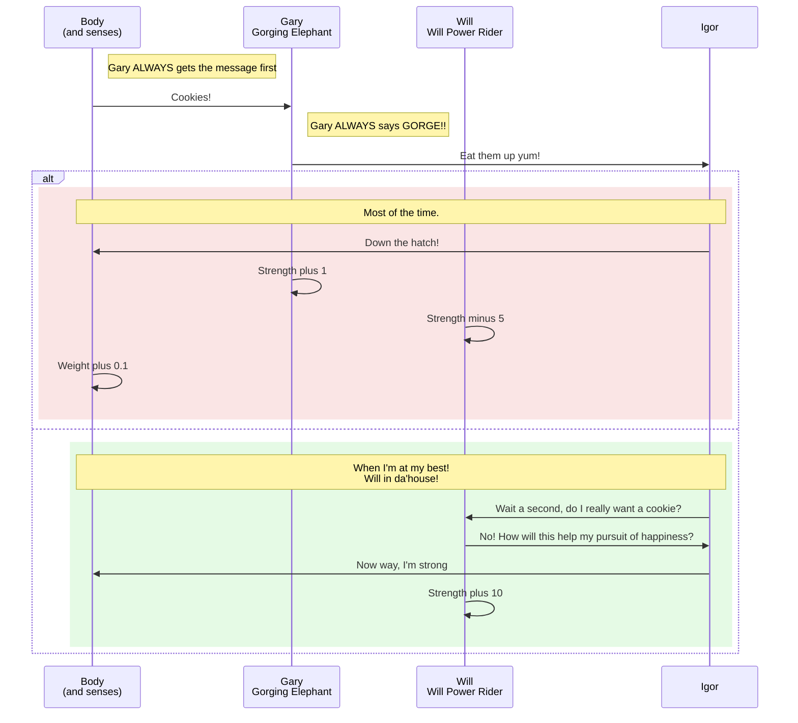

The person that most frequently blocks your success is, wait for it, you! Often it's your subconscious, and often your sub conscious is a bunch of independent voices. It's hard to deal with this hidden opposition because it's so opaque. To help understand your feelings you can name the voices in your head, and imagine asking each of them their positions, and desired outcomes.

I'm not smart (or wacky) enough to come up with this technique on my own. It comes from William Ury, master negotiator, and author of Getting to Yes (and Getting to Yes with yourself). He talks about the importance of applying the negotiating principles to your unconscious. The principles are 1) Soft on people, hard on problems and 2) Focus on interests not positions. (Just like [7H: Seek first to understand](/7h-c4))

These are my voices. I'm teaching myself to spend time talking to each of them so they behave with [compassion](/compassion).

_(BTW the order below is deliberate,it's the order of the voices i want to talk to. I want to give more air time to the positive players)_

### Positive Players

- **Harry** - my habits coach. Always pushing for more habits
- **Carl** - my confidence. Champion of success
- **Peter** - the performer, loves to juggle and do magic, and be goofy.
- **Will** - my will power. Deliberate, stronga and stead.
- **David** - the Dad. Proud like a MoFo
- **Gertrude** - My grandmother mind reassuring me that I can take it easy, and I'm doing the best I can.

### Positive Players (Need to hire)

- **Harold** - the Husband. Treating Love like a verb not a noun.

### Negative Habits

- **Gary** my desire to gorge instead of eating healthy.
- **Vern** my desire to vegetate and not exercise
- **Prashant** my desire to procrastinate

### Anxieties

[Anxiety](/anxiety)

- **Walter** - my anxiety that I'm wasting my life.
- **Ina** - my insecurity that I'm a failure, around when Carl gets sick
- **Terrance** - my frustrations with my wife
- **Frank** - my guilt I'm not doing enough as a father.

### Anxieties (Retired)

- **Mo** - my anxiety about money (retired since the stock market went through roof).
- **Wilma** - my end of month anxiety around hitting my weight goals (Retired since I stopped this habit, but I should probably bring it back ;) )

<orbit-reviewarea color="cyan">
    <orbit-prompt
    question="Who is the voice of Habit?"
    answer="Harry"
    />
    <orbit-prompt
    question="Who is Carl?"
    answer="The voice of my condfidence"
    />
</orbit-reviewarea>

### Appenix: Computer Diagrams

