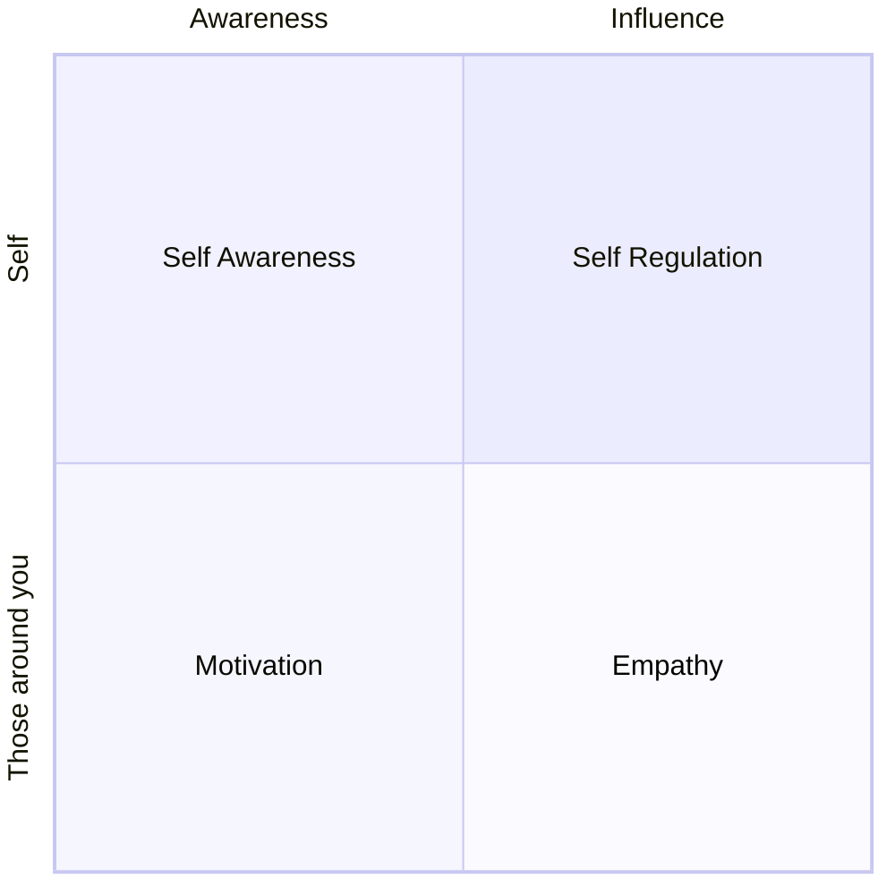

Emotional intelligence (EI) is the crux of leadership. EI is comprised of Self-Awareness, Self-Regulation, Motivation, Empathy and Social Skills. This is a summary of Dan Goleman's [What makes a leader](https://hbr.org/2004/01/what-makes-a-leader). Before we begin, here's a consulting 2x2 grid:

**Self-awareness:** Knowing one's emotions, strengths, weaknesses, drives, values, and goals—and their impact on others

- Realistic self-assessment
- Self-confidence
- Self-deprecating sense of humor
- Thirst for constructive criticism

**Self-regulation:** Controlling or redirecting disruptive emotions and impulses

- Disciplined
- Trustworthiness
- Integrity
- Comfort with ambiguity and change

**Motivation:** Being driven to achieve for the sake of achievement

- A passion for the work itself and for new challenges
- Unflagging energy to improve
- Resiliance - Optimism in the face of failure

**Empathy:** Considering others’ feelings, especially when making decisions

- Expertise in attracting and retaining talent
- Ability to develop others
- Sensitivity to cross-cultural differences

**Social Skill:** Managing relationships to move people in desired directions

- Effectiveness in leading change
- Persuasiveness
- Extensive networking
- Expertise in building and leading teams

## Credits

Samantha Potts - Technical Super Star
