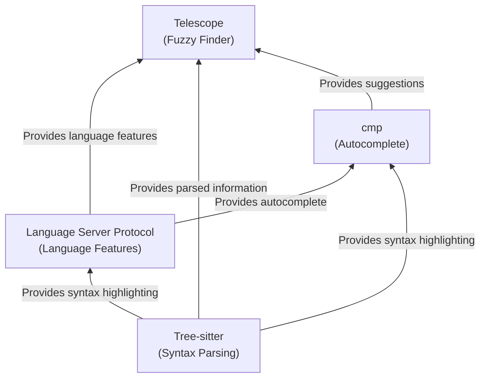

Long ago a fork from vim emerged. Neovim! I avoided it for a long time, but when Bram (the inventor of vim) died, I decided it was time to switch. Now that I've sucked up the 20-40 hours in the conversion, I'm thrilled I did. Turns out all the "kids" have been using and developing on neovim. This results in 1, good tools, and nice best practices.

You can see my configuration and workarounds [here](https://github.com/idvorkin/Settings/tree/master/nvim).

## The good

### Lively active development

I don't hang out with "modern cutting edge" developers, so I don't know the latest and greatest in the community. I rely on web searches for awesome lists. Plugging into new projects lets me see what the "awesome bleeding edge engineers are doing." Nice to uncover new projects and approaches.

### Nice plugins

- Octo - Github workflow management
- Neogit - Git integration (yeah, I know about fugitive)
- DiffViewOpen - Git diff, (as opposed to a file diff)
- Nicer Copilot

### Telescope, LSP, CMP, Treesitter

#### Telescope

This is a fuzzy picker - given a list it lets you pick the thing to do with fuzzy finding as you type. This is helpful for commands like files, windows, and autocompletion

#### CMP

Comp is a completion engine, it builds lists from various sources.

#### LSP - Language Server Protocol.

When VS.Code became popular they factored out the language integration into a separate process. So now language support (refactor, code understanding, find source) runs in a different process and can be high quality instead of just parsing regexp

The way better way to do language integration.

#### Tree Sitter

A super fast grammar parser, supporting parsing partial files and stuff. Much faster then the regexp/vim parsing support

### Git tooling

#### NeoGit

#### DiffViewOnly

#### Gitsigns

#### Speed

Neovim is faster, maybe LUA is faster then VIM Script, VIM9 implemented modern funcctions designed to be faster, but I doubt plugins will be re-written to take advantage of it. If anything, the LUA plugins are faster by default.

## The weird

### Lua

I don't like LUA, I really don't. Luckily, I can mostly use ChatGPT to translate my code to Lua successful.y Now that I'm over the initial hump, maybe I'll even come to terms with it's nice features.

If I'm being honest though, LUA is better then vimscript, once I stop whining about LUA, I'll get used to it and find some portable stuff

### Terminal/Shell Differences

### Prettier UX doesn't work well under Mosh (need to use SSH)
