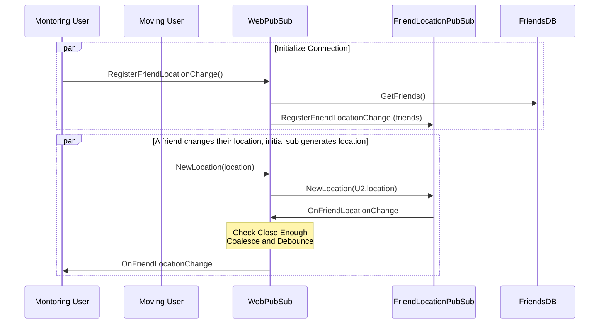
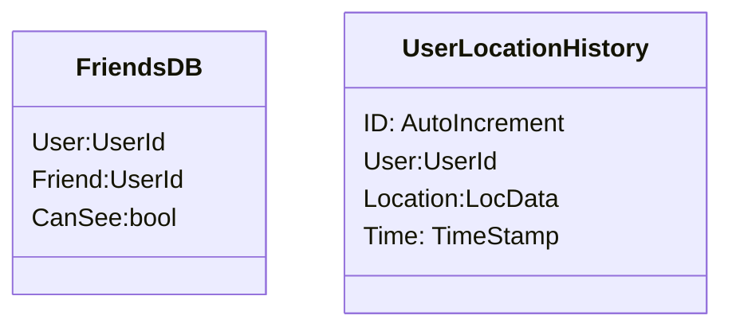

As a technologist I love system designs. I like to tell interview candidates you don't need to practice them, it's what you do every day. In fact, it's one of the favorite parts of my technical role. I never liked crossword puzzles, but I could totally do system design problems instead. Here's a great list ..

Most of these are copied from the system design interview books/tutorials.

<!-- prettier-ignore-start -->

<!-- vim-markdown-toc-start -->

- [Theory](#theory)
    - [Why do these?](#why-do-these)
- [For All System Design Qs](#for-all-system-design-qs)
    - [Users and Use Cases](#users-and-use-cases)
    - [High Level Design](#high-level-design)
    - [APIs](#apis)
    - [Data](#data)
    - [Connections](#connections)
    - [Throughput/Availability](#throughputavailability)
    - [Capacity/Constraints](#capacityconstraints)
    - [Regionalization I18N](#regionalization-i18n)
    - [Non Functional requirements](#non-functional-requirements)
    - [Capacity Estimation](#capacity-estimation)
    - [Money: Monetization + COGS](#money-monetization--cogs)
- [Specific Tech](#specific-tech)
    - [Geo Approaches](#geo-approaches)
- [Other posts](#other-posts)
    - [Design and Architecture](#design-and-architecture)
    - [Cloud first applications](#cloud-first-applications)
    - [Data Systems](#data-systems)
    - [Security](#security)
    - [SQL vs No-SQL](#sql-vs-no-sql)
- [Use cases](#use-cases)
    - [Proximity Service](#proximity-service)
    - [Google Maps](#google-maps)
    - [Distributed Message Queue](#distributed-message-queue)
    - [Metrics Monitoring and Alerting System](#metrics-monitoring-and-alerting-system)
    - [Ad Click Event Aggregation](#ad-click-event-aggregation)
    - [Hotel Reservation System](#hotel-reservation-system)
    - [Distributed Email Service](#distributed-email-service)
    - [S3-like Object Storage](#s3-like-object-storage)
    - [Real-time Gaming Leaderboard](#real-time-gaming-leaderboard)
    - [Payment System](#payment-system)
    - [Digital Wallet](#digital-wallet)
    - [Stock Exchange](#stock-exchange)
    - [Rate limiter](#rate-limiter)
    - [Consistent hashing](#consistent-hashing)
    - [Key-value store](#key-value-store)
    - [Unique id generator](#unique-id-generator)
    - [Url shortener](#url-shortener)
    - [Web crawler](#web-crawler)
    - [Notification system](#notification-system)
    - [News feed system](#news-feed-system)
    - [Chat system](#chat-system)
    - [Search Auto Complete](#search-auto-complete)
    - [Youtube](#youtube)
    - [Google Drive](#google-drive)
    - [Nearby Friends](#nearby-friends)
- [Resources](#resources)
    - [System design resources](#system-design-resources)

<!-- vim-markdown-toc-end -->
<!-- prettier-ignore-end -->

## Theory

### Why do these?

## For All System Design Qs

### Users and Use Cases

### High Level Design

### APIs

### Data

### Connections

_What to call this?_

Polling - Wake up every 'k' seconds and ask

Push - Usually better (always?), only down side is harder to implement, more server load?

Long Poll - Open a http request, leave it open for a while then answer on the server. - Weird hack - What if client dies

Bi-directional - E.g. WebSocket (ideal) - Ideal - Setup over HTTP - Traverses Fire walls

TCP vs UDP

WebSocket vs HTTP/2 + Server Side Events (SSE)

### Throughput/Availability

- Load balancing/bottlenecks/fault points
- Caching, purging, replication, consistency
- Serving data from edge CDN

### Capacity/Constraints

- Capacity
- Scale and usage estimates (include memory, data transmission)
- There are 10e5 seconds in a day
- Other

### Regionalization I18N

- Per locale laws
- Languages
- Data practices
- Geo-distributed
- Edge/CDN

### Non Functional requirements

- Latency
- Scalability
- Availability
- Reliability
- Observability
  - Test ability
  - Monitoring
  - Metrics
  - Logging
  - Alarming
- Deployment
- Supportability
- Non Functional Requirements
  - Security, authentication, authorization

### Capacity Estimation

### Money: Monetization + COGS

## Specific Tech

### Geo Approaches

- As the crow flies - lat/long search - 2d union is expensive
- Geo Hash - Use each digit to divide space into quadrants
- Quad Tree - Geo Divide but so leaves are 'equal sized'

## Other posts

### Design and Architecture



### Cloud first applications



### Data Systems



### Security



### SQL vs No-SQL

Todo Link to Data Systems

- [Dynamo](https://docs.aws.amazon.com/amazondynamodb/latest/developerguide/ServiceQuotas.html)
- SQL

the table

| Type               | TPS | Notes           |
| ------------------ | --- | --------------- |
| Key Value (Dynamo) | 40K | Up to 5 Indexes |
| SQL (Aurora)       | ??  |                 |

## Use cases

### Proximity Service

### Google Maps

### Distributed Message Queue

### Metrics Monitoring and Alerting System

### Ad Click Event Aggregation

### Hotel Reservation System

### Distributed Email Service

### S3-like Object Storage

### Real-time Gaming Leaderboard

### Payment System

### Digital Wallet

### Stock Exchange

### Rate limiter

### Consistent hashing

### Key-value store

### Unique id generator

### Url shortener

### Web crawler

### Notification system

### News feed system

### Chat system

- 1:1 vs Group
- Online vs Offline
- External Notification System
- Presence
  - How to detect user is no longer online
  - How to propagate presence to other users (similar to propagate messages)

### Search Auto Complete

### Youtube

### Google Drive

### Nearby Friends

begin

end

## Resources

### System design resources

Online: - <https://github.com/donnemartin/system-design-primer>

Add Links to Books \* System Design Interviews 1 and 2
